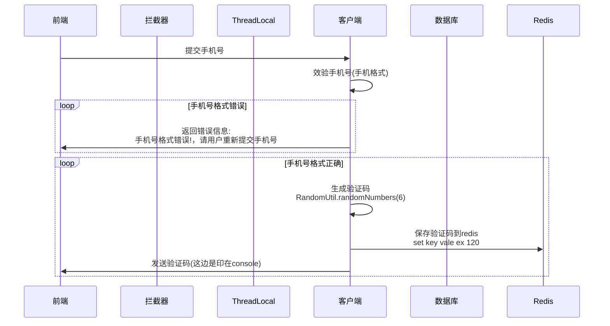
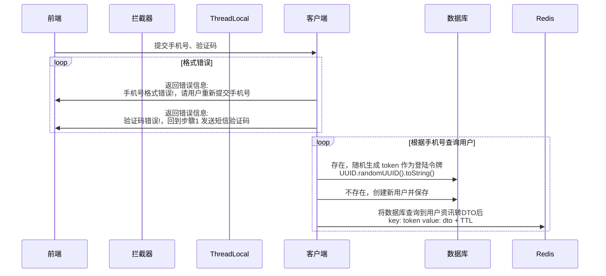
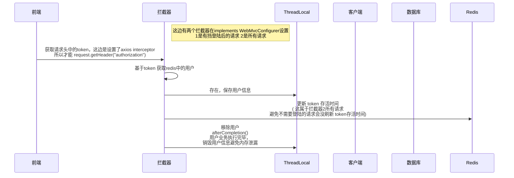

# 发送短信验证码


1. 提交手机号到controller
POST http://localhost:8080/api/user/code?phone=0912345678
2. serviceImpl 效验、生成、保存验证码到session
3. 发送验证码  2024-09-11 14:52:05.380 DEBUG 27896 --- [nio-8081-exec-1] com.hmdp.service.impl.UserServiceImpl    : 发送短信验证码成功 ,验证码:193031

controller
```java
@Slf4j
@RestController
@RequestMapping("/user")
public class UserController {

    @Resource
    private IUserService userService;
    /**
     * 发送手机验证码
     */
    @PostMapping("code")
    public Result sendCode(@RequestParam("phone") String phone, HttpSession session) {
        // TODO 发送短信验证码并保存验证码
        return userService.sendCode(phone ,session);
    }

    /**
     * 登录功能
     * @param loginForm 登录参数，包含手机号、验证码；或者手机号、密码
     */
    @PostMapping("/login")
    public Result login(@RequestBody LoginFormDTO loginForm, HttpSession session){
        // TODO 实现登录功能
        return userService.login(loginForm ,session);
    }
}
```

mapper
```java
public interface UserMapper extends BaseMapper<User> {}
```

service

```java 
public interface IUserService extends IService<User> {
    Result sendCode(String phone, HttpSession session);
    Result login(LoginFormDTO loginForm, HttpSession session);
}
```

```java
package com.hmdp.service.impl;

import cn.hutool.core.util.RandomUtil;
import com.baomidou.mybatisplus.extension.service.impl.ServiceImpl;
import com.hmdp.dto.LoginFormDTO;
import com.hmdp.dto.Result;
import com.hmdp.entity.User;
import com.hmdp.mapper.UserMapper;
import com.hmdp.service.IUserService;
import com.hmdp.utils.RegexUtils;
import lombok.extern.slf4j.Slf4j;
import org.springframework.stereotype.Service;

import javax.servlet.http.HttpSession;
import java.util.Random;

import static com.hmdp.utils.SystemConstants.USER_NICK_NAME_PREFIX;

/**
 * <p>
 * 服务实现类
 * </p>
 *
 * @since 2021-12-22
 */
@Slf4j
@Service
public class UserServiceImpl extends ServiceImpl<UserMapper, User> implements IUserService {

    @Override
    public Result sendCode(String phone, HttpSession session) {
        // 效验手机号
        if(RegexUtils.isPhoneInvalid(phone)){
            // 如果不符合，返回错误信息
            return Result.fail("手机号格式错误!");
        }

        // 如果符合，生成验证码
        String code = RandomUtil.randomNumbers(6);

        // 保存验证码到session
        session.setAttribute("code", code);

        // 发送验证码
        log.debug("发送短信验证码成功 ,验证码:{}" ,code);
        // 返回ok
        return null;
    }

    @Override
    public Result login(LoginFormDTO loginForm, HttpSession session) {
        // 效验手机号
        String phone = loginForm.getPhone();
        if(RegexUtils.isPhoneInvalid(phone)){
            // 如果不符合，返回错误信息
            return Result.fail("手机号格式错误!");
        }
        // 效验验证码
        Object cacheCode = session.getAttribute("code");
        String code = loginForm.getCode();
        if(cacheCode == null || !cacheCode.toString().equals(code)){
            // 不一致， 报错
            return Result.fail("验证码错误");
        }

        // 一致， 根据手机号查询用户
        User user = query().eq("phone" ,phone).one();
        // 判断用户是否存在
        if(user == null){
            // 不存在，创建新用户并保存
            user = createUserWithPhone(phone);
        }
        // 保存用户信息到session
        session.setAttribute("user" ,user);
        return Result.ok();
    }

    private User createUserWithPhone(String phone) {
        // 创建用户
        User user = new User();
        user.setPhone(phone);
        user.setNickName(USER_NICK_NAME_PREFIX + RandomUtil.randomString(10));
        save(user);
        // select  * from tb_user order by create_time desc;
//        User user2 = query().eq("phone" ,phone).one();
//        log.info("user2={}",user2);
        return user;
    }
}

```

# 效验登陆状态 短信验证码登陆、注册

4. login.html POST http://localhost:8080/api/user/login {"phone": "0912345678","code": "636561"}
5. 从seesion获取用户、判断用户是否存在
6. 保存用户信息到 ThreadLocal 或新增用户
7. info.html http://localhost:8080/api/user/me {"id": 1011,"nickName": "user_6qd1xtxk8b","icon": ""}
	- 插在拦截器跟/me这两个看下Holder.getUser 是不是null
	- 拦截器MvcConfig前忘加注解@Configuration导致拦截器没有生效
	- nginx.exe同级目录的html目录下hmdp/login.html第87行index改成info.html
	- 后台/user/me接口的return Result.ok();改成return Result.ok(user); 

vue

created 方法是 Vue.js 中的一个预设生命周期钩子（lifecycle hook）。它在组件实例被创建后立即调用，允许开发者在组件的初始化阶段执行一些操作。

```html 
const app = new Vue({
    created() {
        console.log("组件已创建");
        this.queryUser(); // 例如，调用一个方法来查询用户信息
    }
});
```


拦截器

LoginInterceptor 类实现了 HandlerInterceptor 接口，通常用于在请求处理之前、之后或在异常发生时进行一些处理。

可以在这个类中编写登录验证的逻辑。

```java 
package com.hmdp.utils;

import com.hmdp.dto.UserDTO;
import org.springframework.web.servlet.HandlerInterceptor;

import javax.servlet.http.HttpServletRequest;
import javax.servlet.http.HttpServletResponse;
import javax.servlet.http.HttpSession;

public class LoginInterceptor implements HandlerInterceptor {
    //进到controller 之前登入效验
    @Override
    public boolean preHandle(HttpServletRequest request, HttpServletResponse response, Object handler) throws Exception {
        // 获取 session
        HttpSession session = request.getSession();
        // 获取session 中的用户
        Object user = session.getAttribute("user");
        // 判断用户是否存在
        if(user == null){
            // 不存在，拦截，返回401
            response.setStatus(401);
            return false;
        }

        // 存在，保存用户信息到 ThreadLocal
        UserHolder.saveUser((UserDTO) user);
        // 放行

        return true;
    }

    //用户业务执行完毕，销毁用户信息避免内存泄漏
    @Override
    public void afterCompletion(HttpServletRequest request, HttpServletResponse response, Object handler, Exception ex) throws Exception {
        // 移除用户
        UserHolder.removeUser();
    }
}
```

ThreadLocal

UserHolder 类主要用于在多线程环境中存储和管理用户信息。

它通过 ThreadLocal 类提供了线程隔离的存储机制，确保每个线程都可以独立地存取自己的用户信息，而不会与其他线程的数据发生冲突


```java 
package com.hmdp.utils;

import com.hmdp.dto.UserDTO;

public class UserHolder {
    private static final ThreadLocal<UserDTO> tl = new ThreadLocal<>();

    public static void saveUser(UserDTO user){
        tl.set(user);
    }

    public static UserDTO getUser(){
        return tl.get();
    }

    public static void removeUser(){
        tl.remove();
    }
}
```

MvcConfig 类实现了 WebMvcConfigurer 接口，用于配置 Spring MVC 的各种设置，包括注册拦截器

在这边注册拦截器并设置拦截器哪些接口可以放行

```java 
package com.hmdp.config;

import com.hmdp.utils.LoginInterceptor;
import org.springframework.web.servlet.config.annotation.InterceptorRegistry;
import org.springframework.web.servlet.config.annotation.WebMvcConfigurer;

public class MvcConfig implements WebMvcConfigurer {

    @Override
    public void addInterceptors(InterceptorRegistry registry) {
        registry.addInterceptor(new LoginInterceptor())
                // 排除拦截，也就是可放行的接口
                .excludePathPatterns(
                        "/blog/hot", // 热点的博客
                        "/voucher/**", // 优惠券
                        "/shop/**", //店铺
                        "/shop-type/**", //店铺类型
                        "/upload/**", //上传通常是登入才能，但目前测试需要先放行
                        "/user/code","/user/login"
                );
    }
}

```

controller
```java
@Slf4j
@RestController
@RequestMapping("/user")
public class UserController {

    @GetMapping("/me")
    public Result me(){
        // TODO 获取当前登录的用户并返回
        UserDTO user = UserHolder.getUser();
        return Result.ok(user);
    }
}
```

# session共享问题

使用 Nginx 进行负载均衡时，第一次访问的请求被分配到 Tomcat1，并在该实例中创建了会话（session）。虽然可以将会话数据拷贝到 Tomcat2，但这个过程可能会引入延迟。
如果用户在会话数据尚未同步到 Tomcat2 的情况下再次访问，可能会被分配到 Tomcat2，此时由于延迟，Tomcat2 可能无法获取到最新的会话数据。这可能导致用户在访问过程中遇到会话丢失或状态不一致的问题。 

session的替代方案应该满足:
1. 数据共享
2. 内存存储
3. key,value结构
也就是用redis

# axios 的拦截器

每次发请求的时后执行这段逻辑
也就是说 所有axios 请求都会携带 authorization 请求头 也就是token 
将来服务端就可以获取 authorization 

common.js

```js 
// request拦截器，将用户token放入头中
let token = sessionStorage.getItem("token");
axios.interceptors.request.use(
  config => {
    if(token) config.headers['authorization'] = token
    return config
  },
  error => {
    console.log(error)
    return Promise.reject(error)
  }
)
```
login.html
```js 
axios.post("/user/login", this.form)
    .then(({data}) => {
        if(data){
          // 保存用户信息到session
          sessionStorage.setItem("token", data);
        }
        // 跳转到首页
        location.href = "/info.html"
    })
```

# Redis代替session的业务流程


service

1. 提交手机号、效验手机号
2. 从redis 获取验证码并效验
3. 一致， 根据手机号查询用户
4. 判断用户是否存在
5. 不存在，创建新用户并保存
6. 保存用户信息到redis  随机生成 token 作为登陆令牌 key: token ,value: hash userDTO
7. token 存活时间
   
```java
@Slf4j
@Service
public class UserServiceImpl extends ServiceImpl<UserMapper, User> implements IUserService {

    @Resource
    private StringRedisTemplate stringRedisTemplate; 
@Override
    public Result login_redis(LoginFormDTO loginForm, HttpSession session) {
        // 效验手机号
        String phone = loginForm.getPhone();
        if(RegexUtils.isPhoneInvalid(phone)){
            // 如果不符合，返回错误信息
            return Result.fail("手机号格式错误!");
        }
        // 从redis 获取验证码并效验
        String cacheCode = stringRedisTemplate.opsForValue().get(LOGIN_CODE_KEY + phone);
        String code = loginForm.getCode();
        if(cacheCode == null || !cacheCode.equals(code)){
            // 不一致， 报错
            return Result.fail("验证码错误");
        }

        // 一致， 根据手机号查询用户
        User user = query().eq("phone" ,phone).one();
        // 判断用户是否存在
        if(user == null){
            // 不存在，创建新用户并保存
            user = createUserWithPhone(phone);
        }
        // 保存用户信息到redis
        // 随机生成 token 作为登陆令牌
        String token = UUID.randomUUID().toString();

        // 将 user 对象转为 Hash
        UserDTO userDTO = BeanUtil.copyProperties(user, UserDTO.class);
        // Long to String
        Map<String ,Object> userMap = BeanUtil.beanToMap(userDTO ,new HashMap<>() ,
                CopyOptions.create()
                        .setIgnoreNullValue(true)
                        .setFieldValueEditor((fieldName ,fieldValue) -> fieldValue.toString()));
        String tokenKey = LOGIN_USER_KEY + token;
        // 存储 目前会是 从登入到30分钟会被踢出，但应该是 用户30分钟内不断访问就应该刷新存活时间
        stringRedisTemplate.opsForHash().putAll(tokenKey ,userMap);
        stringRedisTemplate.expire(tokenKey ,CACHE_SHOP_TTL ,TimeUnit.MINUTES);
        // 返回 token
        return Result.ok(token);
    }
}
```

拦截器

8. 基于token 获取redis中的用户
9. 存在，保存用户信息到 ThreadLocal
10. 更新 token 存活时间
```java 
@Slf4j
public class LoginInterceptor implements HandlerInterceptor {
    private StringRedisTemplate stringRedisTemplate;

    public LoginInterceptor(StringRedisTemplate stringRedisTemplate) {
        this.stringRedisTemplate = stringRedisTemplate;
    }
/**
     *  进到controller 之前登入效验
     *  redis
     */
    @Override
    public boolean preHandle(HttpServletRequest request, HttpServletResponse response, Object handler) throws Exception {
        // 获取请求头中的token
        String token = request.getHeader("authorization");
        if(StrUtil.isBlank(token)){
            // 不存在，拦截，返回401
            response.setStatus(401);
            return false;
        }
        String tokenKey = RedisConstants.LOGIN_USER_KEY + token;
        // 基于token 获取redis中的用户
        Map<Object, Object> userMap = stringRedisTemplate.opsForHash().entries(tokenKey);
        // entries() 原本就会判断 空的话返回null
        // 判断用户是否存在
        if(userMap.isEmpty()){
            // 不存在，拦截，返回401
            response.setStatus(401);
            return false;
        }
        UserDTO userDTO = BeanUtil.fillBeanWithMap(userMap, new UserDTO(), false);
        // 将查询的Hash 转UserDTO
        // 存在，保存用户信息到 ThreadLocal
        UserHolder.saveUser(userDTO);

        // 更新 token 存活时间
        stringRedisTemplate.expire(tokenKey ,RedisConstants.CACHE_SHOP_TTL , TimeUnit.MINUTES);

        log.info("preHandle user={}",UserHolder.getUser());
        // 放行

        return true;
    }
```

注入 StringRedisTemplate
```java 
package com.hmdp.config;

import com.hmdp.utils.LoginInterceptor;
import org.springframework.context.annotation.Configuration;
import org.springframework.data.redis.core.StringRedisTemplate;
import org.springframework.web.servlet.config.annotation.InterceptorRegistry;
import org.springframework.web.servlet.config.annotation.WebMvcConfigurer;

import javax.annotation.Resource;

@Configuration
public class MvcConfig implements WebMvcConfigurer {

    @Resource
    private StringRedisTemplate stringRedisTemplate;
    @Override
    public void addInterceptors(InterceptorRegistry registry) {
        registry.addInterceptor(new LoginInterceptor(stringRedisTemplate))
                // 排除拦截，也就是可放行的接口
                .excludePathPatterns(
                        "/blog/hot", // 热点的博客
                        "/voucher/**", // 优惠券
                        "/shop/**", //店铺
                        "/shop-type/**", //店铺类型
                        "/upload/**", //上传通常是登入才能，但目前测试需要先放行
                        "/user/code",
                        "/user/login"
                );
    }
}

```

# 优化拦截器

由于原本的拦截器是拦截有需要登入的路径，会导致部份访问有需要登入的路径时才会刷新token存活时间

所以这边优化拦截器就是需要增加一个拦截所有路径的拦截器，让即使登入后从头到尾都没访问到需要登入的路径的用户也可以不断刷新token存活时间


拦截器1

```java
package com.hmdp.utils;

import cn.hutool.core.bean.BeanUtil;
import cn.hutool.core.util.StrUtil;
import com.hmdp.dto.UserDTO;
import lombok.extern.slf4j.Slf4j;
import org.springframework.data.redis.core.StringRedisTemplate;
import org.springframework.web.servlet.HandlerInterceptor;

import javax.servlet.http.HttpServletRequest;
import javax.servlet.http.HttpServletResponse;
import java.util.Map;
import java.util.concurrent.TimeUnit;


@Slf4j
public class RefreshTokenInterceptor implements HandlerInterceptor {
    private StringRedisTemplate stringRedisTemplate;

    public RefreshTokenInterceptor(StringRedisTemplate stringRedisTemplate) {
        this.stringRedisTemplate = stringRedisTemplate;
    }

    /**
     *  进到controller 之前登入效验
     *  redis
     */
    // TODO: 拦截所有路径，因为原本的拦截器只拦截登陆时的路径，如果用户登陆后都访问不需要登陆的路径，原拦截器就无法刷新token 存活时间
    @Override
    public boolean preHandle(HttpServletRequest request, HttpServletResponse response, Object handler) throws Exception {
        // 获取请求头中的token
        String token = request.getHeader("authorization");
        if(StrUtil.isBlank(token)){
            return true;
        }
        String tokenKey = RedisConstants.LOGIN_USER_KEY + token;
        // 基于token 获取redis中的用户
        Map<Object, Object> userMap = stringRedisTemplate.opsForHash().entries(tokenKey);
        // entries() 原本就会判断 空的话返回null
        // 判断用户是否存在
        if(userMap.isEmpty()){
            return true;
        }
        UserDTO userDTO = BeanUtil.fillBeanWithMap(userMap, new UserDTO(), false);
        // 将查询的Hash 转UserDTO
        // 存在，保存用户信息到 ThreadLocal
        UserHolder.saveUser(userDTO);

        // 更新 token 存活时间
        stringRedisTemplate.expire(tokenKey ,RedisConstants.CACHE_SHOP_TTL , TimeUnit.MINUTES);

//        log.info("preHandle user={}",UserHolder.getUser());
        // 放行

        return true;
    }

    //用户业务执行完毕，销毁用户信息避免内存泄漏
    @Override
    public void afterCompletion(HttpServletRequest request, HttpServletResponse response, Object handler, Exception ex) throws Exception {
        // 移除用户
        UserHolder.removeUser();
    }
}

```

拦截器2

```java
package com.hmdp.utils;

import cn.hutool.core.bean.BeanUtil;
import cn.hutool.core.util.StrUtil;
import com.hmdp.dto.UserDTO;
import lombok.extern.slf4j.Slf4j;
import org.springframework.data.redis.core.StringRedisTemplate;
import org.springframework.web.servlet.HandlerInterceptor;

import javax.servlet.http.HttpServletRequest;
import javax.servlet.http.HttpServletResponse;

import java.util.Map;
import java.util.concurrent.TimeUnit;


@Slf4j
public class LoginInterceptor implements HandlerInterceptor {
    private StringRedisTemplate stringRedisTemplate;

    public LoginInterceptor(StringRedisTemplate stringRedisTemplate) {
        this.stringRedisTemplate = stringRedisTemplate;
    }

    // TODO: RefreshTokenInterceptor 拦截所有路径，因为原本的拦截器只拦截登陆时的路径，如果用户登陆后都访问不需要登陆的路径，原拦截器就无法刷新token 存活时间

    @Override
    public boolean preHandle(HttpServletRequest request, HttpServletResponse response, Object handler) throws Exception {
        if(UserHolder.getUser()== null){
            response.setStatus(401);
            return false;
        }
        // 放行
        return true;
    }
}

```

拦截器设置

拦截顺序:
1. 加order() 
2. 照顺序写 也能达到相同效果
3. 拦所有请求 默认就是 .addPathPatterns("/**") 不加也没差

```java 
package com.hmdp.config;

import com.hmdp.utils.LoginInterceptor;
import com.hmdp.utils.RefreshTokenInterceptor;
import org.springframework.context.annotation.Configuration;
import org.springframework.data.redis.core.StringRedisTemplate;
import org.springframework.web.servlet.config.annotation.InterceptorRegistry;
import org.springframework.web.servlet.config.annotation.WebMvcConfigurer;

import javax.annotation.Resource;

@Configuration
public class MvcConfig implements WebMvcConfigurer {

    @Resource
    private StringRedisTemplate stringRedisTemplate;
    @Override
    public void addInterceptors(InterceptorRegistry registry) {
        // 拦截顺序:1. 加order() 或是 2.照顺序写 也能达到相同效果
        // 拦所有请求 默认就是 .addPathPatterns("/**") 不加也没差
        registry.addInterceptor(new RefreshTokenInterceptor(stringRedisTemplate)).addPathPatterns("/**").order(0);

        // 拦部份请求
        registry.addInterceptor(new LoginInterceptor(stringRedisTemplate))
                // 排除拦截，也就是可放行的接口
                .excludePathPatterns(
                        "/blog/hot", // 热点的博客
                        "/voucher/**", // 优惠券
                        "/shop/**", //店铺
                        "/shop-type/**", //店铺类型
                        "/upload/**", //上传通常是登入才能，但目前测试需要先放行
                        "/user/code",
                        "/user/login"
                ).order(1);
    }
}
```

# 总结

## 发送短信验证码


## 短信验证码登陆/注册



## 效验登陆状态 (implements HandlerInterceptor 登入的拦截器)


