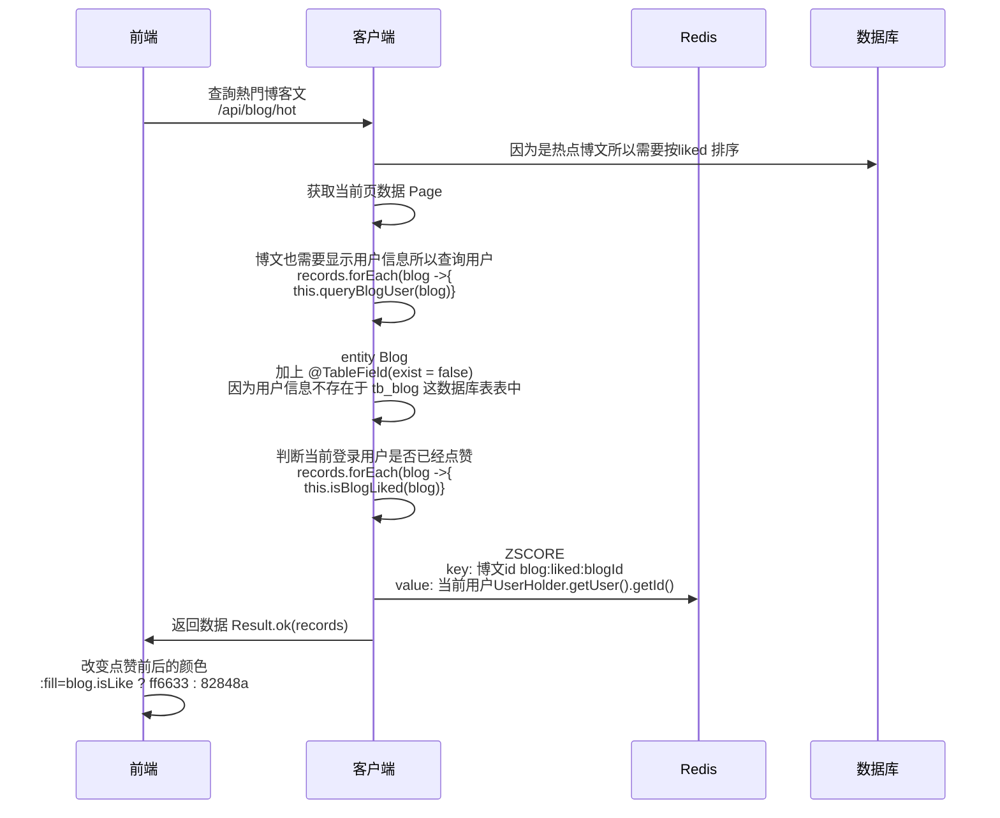
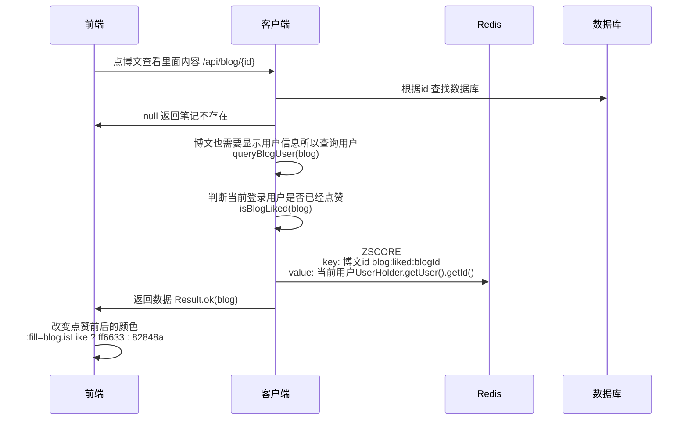

# 达人探店

- 发布探店笔记
- 点赞
- 点赞排行榜

# 发布探店笔记

探店笔记类似点评网站的评价,往往是图文结合。对应的表有两个:
- tb_blog:探店笔记表,包含笔记中的标题、文字、图片等
- tb_blog_comments: 其他用户对探店笔记的评价

/blog-edit.html

## 登入闪退

操作登陆后后端console 没有跳异常

于是看了下~\nginx-1.18.0\logs\error.log

可以看到log有请求 8082

是前面在测负载均衡时有换成轮流 8081、8082

```log
2024/10/08 13:32:56 [error] 4916#5664: *88 connect() failed (10061: No connection could be made because the target machine actively refused it) while connecting to upstream, client: 127.0.0.1, server: localhost, request: "GET /api/user/me HTTP/1.1", upstream: "http://127.0.0.1:8082/user/me", host: "localhost:8080", referrer: "http://localhost:8080/info.html"
2024/10/08 13:32:57 [error] 4916#5664: *95 CreateFile() "D:\e01\nginx-1.18.0/html/hmdp/js/axios.min.map" failed (2: The system cannot find the file specified), client: 127.0.0.1, server: localhost, request: "GET /js/axios.min.map HTTP/1.1", host: "localhost:8080"
2024/10/08 13:33:27 [error] 4916#5664: *95 connect() failed (10061: No connection could be made because the target machine actively refused it) while connecting to upstream, client: 127.0.0.1, server: localhost, request: "POST /api/user/login HTTP/1.1", upstream: "http://127.0.0.1:8082/user/login", host: "localhost:8080", referrer: "http://localhost:8080/login.html"
2024/10/08 13:33:36 [error] 4916#5664: *91 CreateFile() "D:\e01\nginx-1.18.0/html/hmdp/js/axios.min.map" failed (2: The system cannot find the file specified), client: 127.0.0.1, server: localhost, request: "GET /js/axios.min.map HTTP/1.1", host: "localhost:8080"
2024/10/08 13:33:38 [error] 4916#5664: *94 connect() failed (10061: No connection could be made because the target machine actively refused it) while connecting to upstream, client: 127.0.0.1, server: localhost, request: "GET /api/user/me HTTP/1.1", upstream: "http://127.0.0.1:8082/user/me", host: "localhost:8080", referrer: "http://localhost:8080/info.html"
2024/10/08 13:33:38 [error] 4916#5664: *92 CreateFile() "D:\e01\nginx-1.18.0/html/hmdp/js/axios.min.map" failed (2: The system cannot find the file specified), client: 127.0.0.1, server: localhost, request: "GET /js/axios.min.map HTTP/1.1", host: "localhost:8080"
```

~\nginx-1.18.0\conf\nginx.conf

先改 8081 就好

```
http {
    server {
        location /api {  
            proxy_pass http://127.0.0.1:8081;
            # proxy_pass http://backend;
        }
    }

    upstream backend {
        server 127.0.0.1:8081 max_fails=5 fail_timeout=10s weight=1;
        server 127.0.0.1:8082 max_fails=5 fail_timeout=10s weight=1;
    }  
}
```

## 上传图片

POST /api/upload/blog
```java 
package com.hmdp.controller;

import cn.hutool.core.io.FileUtil;
import cn.hutool.core.util.StrUtil;
import com.hmdp.dto.Result;
import com.hmdp.utils.SystemConstants;
import lombok.extern.slf4j.Slf4j;
import org.springframework.web.bind.annotation.*;
import org.springframework.web.multipart.MultipartFile;

import java.io.File;
import java.io.IOException;
import java.util.UUID;

@Slf4j
@RestController
@RequestMapping("upload")
public class UploadController {

    @PostMapping("blog")
    public Result uploadImage(@RequestParam("file") MultipartFile image) {
        try {
            // 获取原始文件名称
            String originalFilename = image.getOriginalFilename();
            // 生成新文件名
            String fileName = createNewFileName(originalFilename);
            // 保存文件
            image.transferTo(new File(SystemConstants.IMAGE_UPLOAD_DIR, fileName));
            // 返回结果
            log.debug("文件上传成功，{}", fileName);
            return Result.ok(fileName);
        } catch (IOException e) {
            throw new RuntimeException("文件上传失败", e);
        }
    }

    private String createNewFileName(String originalFilename) {
        // 获取后缀
        String suffix = StrUtil.subAfter(originalFilename, ".", true);
        // 生成目录
        String name = UUID.randomUUID().toString();
        int hash = name.hashCode();
        int d1 = hash & 0xF;
        int d2 = (hash >> 4) & 0xF;
        // 判断目录是否存在
        File dir = new File(SystemConstants.IMAGE_UPLOAD_DIR, StrUtil.format("/blogs/{}/{}", d1, d2));
        if (!dir.exists()) {
            dir.mkdirs();
        }
        // 生成文件名
        return StrUtil.format("/blogs/{}/{}/{}.{}", d1, d2, name, suffix);
    }
    
    @GetMapping("/blog/delete")
    public Result deleteBlogImg(@RequestParam("name") String filename) {
        File file = new File(IMAGE_UPLOAD_DIR, filename);
        if (file.isDirectory()) {
            return Result.fail("错误的文件名称");
        }
        FileUtil.del(file);
        return Result.ok();
    }
}

```

```java 
package com.hmdp.utils;

public class SystemConstants {
    // 这边是存本地 ，记得改存放图片的路径
    public static final String IMAGE_UPLOAD_DIR = "D:\\e01\\nginx-1.18.0\\html\\hmdp\\imgs\\";
    public static final String USER_NICK_NAME_PREFIX = "user_";
    public static final int DEFAULT_PAGE_SIZE = 5;
    public static final int MAX_PAGE_SIZE = 10;
}

```

### 前端

1. 点击这个按钮会调用 openFileDialog 方法，打开文件选择对话框。

```html
<div class="upload-btn" @click="openFileDialog">
   <i class="el-icon-camera"></i>
   <div style="font-size: 12px;line-height: 12px">上传照片</div>
</div>
```
```javascript
openFileDialog() {
        this.$refs.fileInput.click();
      },
```
2. $refs.fileInput 就可以去访问 ref="fileInput" 的元素
   
这是一个隐藏的文件输入框，当用户选择文件时，会触发 fileSelected 方法。

```html
<input type="file" @change="fileSelected" name="file" ref="fileInput" style="display: none">
```

3. 获取文件并上传至服务器
 - 获取选中的文件并创建一个 FormData 对象。
 - 使用 axios.post() 将文件上传到服务器。
 - 在成功回调中，将服务器返回的图片路径添加到 fileList 数组中。
	- fileList 用于存储已上传文件的路径


```javascript
const app = new Vue({
    el: "#app",
    data() {
        return {
            fileList: [], // 文件列表
        };
    },
  methods: {
 	fileSelected() {
		// 取得文件
            let file = this.$refs.fileInput.files[0];
		// 获取选中的文件并创建一个 FormData 对象。
            let formData = new FormData();
            formData.append("file", file);
		// 为了确保服务器能够正确识别请求体中的文件内容。
		// boundary 是用于分隔不同部分数据的字符串，帮助服务器理解每个部分的开始和结束
            const config = {
                headers: {"Content-Type": "multipart/form-data;boundary=" + new Date().getTime()}
            };
		// 使用 axios.post() 将文件上传到服务器
            axios.post("/upload/blog", formData, config)
                .then(({data}) => this.fileList.push('/imgs' + data))
                .catch(this.$message.error);
        },
```

4. 使用 v-for 指令遍历 fileList 数组，动态生成每个已上传图片的  标签。
v-for=(item, index)

图片列表：
```html
<div class="pic-list">
   <div class="pic-box" v-for="(f,i) in fileList" :key="i">
     
     <i class="el-icon-close" @click="deletePic(i)"></i>
   </div>
</div>
```

f：代表当前循环中 fileList 数组中的每个元素（即图片的路径），并用于设置 `` 标签的 src 属性。

i：是当前元素的索引，允许您在循环中跟踪元素的位置。在这里，它用于为每个图片生成唯一的 key 值，以提高渲染性能和避免潜在的渲染错误。


5. 点选图片右上的x可以删除图片

```javascript
deletePic(i) {
        axios.get("/upload/blog/delete?name=" + this.fileList[i])
          .then(() => this.fileList.splice(i, 1))
          .catch(this.$message.error)
      },
```


## 发布时选择关联的商户 

/blog-edit.html 

GET /api/shop/of/name?name= 


```java 
@RestController
@RequestMapping("/shop")
public class ShopController {
 /**
     * 根据商铺名称关键字分页查询商铺信息
     * @param name 商铺名称关键字
     * @param current 页码
     * @return 商铺列表
     */
    @GetMapping("/of/name")
    public Result queryShopByName(
            @RequestParam(value = "name", required = false) String name,
            @RequestParam(value = "current", defaultValue = "1") Integer current
    ) {
        // 根据类型分页查询
        Page<Shop> page = shopService.query()
                .like(StrUtil.isNotBlank(name), "name", name)
		// 分页限制
                .page(new Page<>(current, SystemConstants.MAX_PAGE_SIZE));
        // 返回数据
        return Result.ok(page.getRecords());
    }
}
```

### 前端

搜索商户

```html
  <div class="search-input">
          <i class="el-icon-search" @click="queryShops"></i>
          <input v-model="shopName" type="text" placeholder="搜索商户名称">
        </div>
```

```javascript
 const app = new Vue({
    el: "#app",
    data() {
      return {
        shops: [], // 商户信息
	}
    },
    created() {
      this.checkLogin();
      this.queryShops();
    },
    methods: {
	queryShops() {
	        axios.get("/shop/of/name?name=" + this.shopName)
	          .then(({data}) => this.shops = data)
	          .catch(this.$message.error)
      },
```
选择商户
```html
<div class="shop-list">
        <div v-for="s in shops" class="shop-item" @click="selectShop(s)">
          <div class="shop-name">{{s.name}}</div>
          <div>{{s.area}}</div>
        </div>
      </div>
```

```javascript
const app = new Vue({
    el: "#app",
    data() {
      return {
        showDialog: false, 
        selectedShop: {}, // 选中的商户
      }
    },
methods: {
	selectShop(s) {
	        this.selectedShop = s;
	        this.showDialog = false;
      },
```
搜寻关联的商户被包在这个dialog 里面，只有点选时才会显示，选完后就会false 关掉
```html
<div class="blog-shop" @click="showDialog=true">
```

## 发布

POST /api/blog

```java
package com.hmdp.controller;


import com.baomidou.mybatisplus.extension.plugins.pagination.Page;
import com.hmdp.dto.Result;
import com.hmdp.dto.UserDTO;
import com.hmdp.entity.Blog;
import com.hmdp.entity.User;
import com.hmdp.service.IBlogService;
import com.hmdp.service.IUserService;
import com.hmdp.utils.SystemConstants;
import com.hmdp.utils.UserHolder;
import org.springframework.web.bind.annotation.*;

import javax.annotation.Resource;
import java.util.List;

/**
 * <p>
 * 前端控制器
 * </p>
 *
 * @author 虎哥
 * @since 2021-12-22
 */
@RestController
@RequestMapping("/blog")
public class BlogController {

    @Resource
    private IBlogService blogService;
    @Resource
    private IUserService userService;

    @PostMapping
    public Result saveBlog(@RequestBody Blog blog) {
        // 获取登录用户
        UserDTO user = UserHolder.getUser();
        blog.setUserId(user.getId());
        // 保存探店博文
        blogService.save(blog);
        // 返回id
        return Result.ok(blog.getId());
    }
}
```

## 个人主页的博文

```java 
@RestController
@RequestMapping("/blog")
public class BlogController {

    @GetMapping("/of/me")
    public Result queryMyBlog(@RequestParam(value = "current", defaultValue = "1") Integer current) {
        // 获取登录用户
        UserDTO user = UserHolder.getUser();
        // 根据用户查询
        Page<Blog> page = blogService.query()
                .eq("user_id", user.getId()).page(new Page<>(current, SystemConstants.MAX_PAGE_SIZE));
        // 获取当前页数据
        List<Blog> records = page.getRecords();
        return Result.ok(records);
    }
}
```

### 前端

/info.html

```javascript
const app = new Vue({
    el: "#app",
    data: {
      blogs: [],
    },
  methods: {
      queryBlogs() {
        axios.get("/blog/of/me")
          .then(({data}) => this.blogs = data)
          .catch(this.$message.error)
      },
```
el-tab-pane 在笔记这个书签
```html
<el-tab-pane label="笔记" name="1">
        <div v-for="b in blogs" :key="b.id" class="blog-item">
          <div class="blog-img"></div>
          <div class="blog-info">
            <div class="blog-title">{{b.title}}</div>
            <div class="blog-liked"> {{b.liked}}</div>
            <div class="blog-comments"><i class="el-icon-chat-dot-round"></i> {{b.comments}}</div>
          </div>
        </div>
      </el-tab-pane>
```


# 查看探店笔记

entity

@TableField(exist = false)
这个注解用于指示某个字段在数据库表中不存在，MyBatis Plus 在进行数据库操作时会忽略这个字段。这意味着该字段不会被映射到数据库中的任何列，

```java
package com.hmdp.entity;

import com.baomidou.mybatisplus.annotation.IdType;
import com.baomidou.mybatisplus.annotation.TableField;
import com.baomidou.mybatisplus.annotation.TableId;
import com.baomidou.mybatisplus.annotation.TableName;
import lombok.Data;
import lombok.EqualsAndHashCode;
import lombok.experimental.Accessors;

import java.io.Serializable;
import java.time.LocalDateTime;

/**
 * <p>
 * 
 * </p>
 *
 * @author 虎哥
 * @since 2021-12-22
 */
@Data
@EqualsAndHashCode(callSuper = false)
@Accessors(chain = true)
@TableName("tb_blog")
public class Blog implements Serializable {

    private static final long serialVersionUID = 1L;

    /**
     * 主键
     */
    @TableId(value = "id", type = IdType.AUTO)
    private Long id;
    /**
     * 商户id
     */
    private Long shopId;
    /**
     * 用户id
     */
    private Long userId;
    /**
     * 用户图标
     */
    @TableField(exist = false)
    private String icon;
    /**
     * 用户姓名
     */
    @TableField(exist = false)
    private String name;

}
```
控制器

GET /api/blog/hot

/blog-detail.html?id=24
GET /api/blog/{id}

```java 
package com.hmdp.controller;


import com.baomidou.mybatisplus.extension.plugins.pagination.Page;
import com.hmdp.dto.Result;
import com.hmdp.dto.UserDTO;
import com.hmdp.entity.Blog;
import com.hmdp.service.IBlogService;
import com.hmdp.service.IUserService;
import com.hmdp.utils.SystemConstants;
import com.hmdp.utils.UserHolder;
import org.springframework.web.bind.annotation.*;

import javax.annotation.Resource;
import java.util.List;

/**
 * <p>
 * 前端控制器
 * </p>
 *
 * @author 虎哥
 * @since 2021-12-22
 */
@RestController
@RequestMapping("/blog")
public class BlogController {

    @Resource
    private IBlogService blogService;
    @Resource
    private IUserService userService;

    @GetMapping("/hot")
    public Result queryHotBlog(@RequestParam(value = "current", defaultValue = "1") Integer current) {
        return blogService.queryHotBlog(current);
    }

    @GetMapping("/{id}")
    public Result queryBlogById(@PathVariable("id") Long id){
        return blogService.queryBlogById(id);
    }
}

```

业务

```java 
package com.hmdp.service.impl;


import com.baomidou.mybatisplus.extension.plugins.pagination.Page;
import com.hmdp.dto.Result;
import com.hmdp.entity.Blog;
import com.hmdp.entity.User;
import com.hmdp.mapper.BlogMapper;
import com.hmdp.service.IBlogService;
import com.baomidou.mybatisplus.extension.service.impl.ServiceImpl;
import com.hmdp.service.IUserService;
import com.hmdp.utils.SystemConstants;
import org.springframework.stereotype.Service;

import javax.annotation.Resource;
import java.util.List;

/**
 * <p>
 *  服务实现类
 * </p>
 *
 * @author 虎哥
 * @since 2021-12-22
 */
@Service
public class BlogServiceImpl extends ServiceImpl<BlogMapper, Blog> implements IBlogService {
    @Resource
    private IBlogService blogService;
    @Resource
    private IUserService userService;
    @Override
    public Result queryBlogById(Long id) {
        Blog blog = getById(id);
        if(blog == null){
            return Result.fail("笔记不存在");
        }
        queryBlogUser(blog);
        return Result.ok(blog);
    }

    @Override
    public Result queryHotBlog(Integer current) {
        // 因为是热点博文所以需要按liked 排序
        Page<Blog> page = blogService.query()
                .orderByDesc("liked")
                .page(new Page<>(current, SystemConstants.MAX_PAGE_SIZE));
        // 获取当前页数据
        List<Blog> records = page.getRecords();
        // 博文也需要显示用户信息所以查询用户
//        records.forEach(blog ->{
//            queryBlogUser(blog);
//        });
        records.forEach(this::queryBlogUser);
        return Result.ok(records);
    }

    private void queryBlogUser(Blog blog) {
        Long userId = blog.getUserId();
        User user = userService.getById(userId);
        blog.setName(user.getNickName());
        blog.setIcon(user.getIcon());
    }
}
```

# 点赞功能

需求:
- 同一个用户只能点赞一次,再次点击则取消点赞
- 如果当前用户已经点赞,则点赞按钮高亮显示(前端已实现,判断字段Blog类的isLike属性)

实现步骤:
1. 给Blog类中添加一个isLike字段,标示是否被当前用户点赞
2. 修改点赞功能,利用Redis的set集合判断是否点赞过,未点赞过则点赞数+1,已点赞过则点赞数-1
3. 修改根据id查询Blog的业务,判断当前登录用户是否点赞过,赋值给isLike字段
4. 修改分页查询Blog业务,判断当前登录用户是否点赞过,赋值给isLike字段

测试
```bash 
192.168.33.10:6379> SADD b1 1 2 3
(integer) 3
192.168.33.10:6379> SISMEMBER b1 3
(integer) 1
192.168.33.10:6379> SISMEMBER b1 4
(integer) 0
192.168.33.10:6379> SREM b1 2
(integer) 1

192.168.33.10:6379> SMEMBERS b1
1) "1"
2) "3"
```


```java 
    /**
     * 是否点赞过了
     */
    @TableField(exist = false)
    private Boolean isLike;
```

```java 
package com.hmdp.service.impl;


import cn.hutool.core.util.BooleanUtil;
import com.baomidou.mybatisplus.extension.plugins.pagination.Page;
import com.hmdp.dto.Result;
import com.hmdp.entity.Blog;
import com.hmdp.entity.User;
import com.hmdp.mapper.BlogMapper;
import com.hmdp.service.IBlogService;
import com.baomidou.mybatisplus.extension.service.impl.ServiceImpl;
import com.hmdp.service.IUserService;
import com.hmdp.utils.SystemConstants;
import com.hmdp.utils.UserHolder;
import org.springframework.data.redis.core.StringRedisTemplate;
import org.springframework.stereotype.Service;

import javax.annotation.Resource;
import java.util.List;

/**
 * <p>
 *  服务实现类
 * </p>
 *
 * @author 虎哥
 * @since 2021-12-22
 */
@Service
public class BlogServiceImpl extends ServiceImpl<BlogMapper, Blog> implements IBlogService {
    @Resource
    private IBlogService blogService;
    @Resource
    private IUserService userService;

    @Resource
    private StringRedisTemplate stringRedisTemplate;
    @Override
    public Result queryBlogById(Long id) {
        Blog blog = getById(id);
        if(blog == null){
            return Result.fail("笔记不存在");
        }
        queryBlogUser(blog);
        // 查询blog 是否被点赞
        isBlogLiked(blog);
        return Result.ok(blog);
    }

    private void isBlogLiked(Blog blog) {
        // 1. 获取登陆用户
        Long userId = UserHolder.getUser().getId();
        // 2. 判断当前登录用户是否已经点赞
        String key = "blog:liked:" + blog.getId();
        Boolean isMember = stringRedisTemplate.opsForSet().isMember(key, userId.toString());

        blog.setIsLike(BooleanUtil.isTrue(isMember));
    }

    @Override
    public Result queryHotBlog(Integer current) {
        // 根据用户查询
        Page<Blog> page = blogService.query()
                .orderByDesc("liked")
                .page(new Page<>(current, SystemConstants.MAX_PAGE_SIZE));
        // 获取当前页数据
        List<Blog> records = page.getRecords();
        // 查询用户
        records.forEach(blog ->{
            this.queryBlogUser(blog);
            this.isBlogLiked(blog);
        });
//        records.forEach(this::queryBlogUser);
        return Result.ok(records);
    }

    @Override
    public Result likeBlog(Long id) {
        // 1. 获取登陆用户
        Long userId = UserHolder.getUser().getId();
        // 2. 判断当前登录用户是否已经点赞
        String key = "blog:liked:" + id;
        Boolean isMember = stringRedisTemplate.opsForSet().isMember(key, userId.toString());
        if(BooleanUtil.isFalse(isMember)){
            // 3. 如果未点赞，可以点赞
            // 3.1. 数据库点赞数+1
            boolean isSuccess = update().setSql("liked = liked + 1").eq("id", id).update();
            // 3.2. 保存用户 redis set集合 SADD、SISMEMBER
            if(isSuccess){
                stringRedisTemplate.opsForSet().add(key ,userId.toString());
            }
        }else{
            // 3. 如果已点赞，取消点赞 SMOVE
            // 3.1. 数据库点赞数-1
            boolean isSuccess = update().setSql("liked = liked - 1").eq("id", id).update();
            // 3.2. 移除用户 redis set集合
            if(isSuccess){
                stringRedisTemplate.opsForSet().remove(key ,userId.toString());
            }
        }
        return Result.ok();
    }

    private void queryBlogUser(Blog blog) {
        Long userId = blog.getUserId();
        User user = userService.getById(userId);
        blog.setName(user.getNickName());
        blog.setIcon(user.getIcon());
    }
}

```

# 点赞排行榜

List RPUSH 
- 最早的会在最前面
- 不唯一 
- 要知道元素存不存在只能遍历查找

SortedSet 
- 时间戳放score 
- 哈希表

测试
```bash
192.168.33.10:6379> ZADD z1 1 m1 2 m2 3 m3
(integer) 3
192.168.33.10:6379> ZSCORE z1 m1
"1"
192.168.33.10:6379> ZSCORE z1 m4
(nil)
192.168.33.10:6379> ZRANGE z1 0 4
1) "m1"
2) "m2"
3) "m3"
```

## ZSET

点赞只能点一次，已点过赞的文章再点一次就是收回

控制器
```java 
    // 点赞排行榜
    @GetMapping("/likes/{id}")
    public Result queryBlogLikes(@PathVariable("id") Long id) {
        return blogService.queryBlogLikes(id);
    }

```
业务
```java 
package com.hmdp.service.impl;


import cn.hutool.core.bean.BeanUtil;
import cn.hutool.core.util.BooleanUtil;
import cn.hutool.core.util.StrUtil;
import com.baomidou.mybatisplus.extension.plugins.pagination.Page;
import com.hmdp.dto.Result;
import com.hmdp.dto.UserDTO;
import com.hmdp.entity.Blog;
import com.hmdp.entity.User;
import com.hmdp.mapper.BlogMapper;
import com.hmdp.service.IBlogService;
import com.baomidou.mybatisplus.extension.service.impl.ServiceImpl;
import com.hmdp.service.IUserService;
import com.hmdp.utils.SystemConstants;
import com.hmdp.utils.UserHolder;
import org.springframework.data.redis.core.StringRedisTemplate;
import org.springframework.stereotype.Service;

import javax.annotation.Resource;
import java.util.Collections;
import java.util.List;
import java.util.Set;
import java.util.stream.Collectors;
import java.util.stream.Stream;

import static com.hmdp.utils.RedisConstants.BLOG_LIKED_KEY;

/**
 * <p>
 *  服务实现类
 * </p>
 *
 * @author 虎哥
 * @since 2021-12-22
 */
@Service
public class BlogServiceImpl extends ServiceImpl<BlogMapper, Blog> implements IBlogService {
    @Resource
    private IBlogService blogService;
    @Resource
    private IUserService userService;

    @Resource
    private StringRedisTemplate stringRedisTemplate;
    @Override
    public Result queryBlogById(Long id) {
        Blog blog = getById(id);
        if(blog == null){
            return Result.fail("笔记不存在");
        }
        queryBlogUser(blog);
        // 查询blog 是否被点赞
        isBlogLiked(blog);
        return Result.ok(blog);
    }


    @Override
    public Result queryHotBlog(Integer current) {
        Page<Blog> page = blogService.query()
                .orderByDesc("liked")
                .page(new Page<>(current, SystemConstants.MAX_PAGE_SIZE));
        // 获取当前页数据
        List<Blog> records = page.getRecords();
        // 查询用户
        records.forEach(blog ->{
            this.queryBlogUser(blog);
            this.isBlogLiked(blog);
        });
//        records.forEach(this::queryBlogUser);
        return Result.ok(records);
    }

    // 查看当前用户是否对博客点赞
    private void isBlogLiked(Blog blog) {
        // 1. 获取登陆用户
        Long userId = UserHolder.getUser().getId();
        if(userId == null){
            // 用户未登录，无需查询是否点赞
            return;
        }
        // 2. 判断当前登录用户是否已经点赞
        String key = "blog:liked:" + blog.getId();

        //SET
//        Boolean isMember = stringRedisTemplate.opsForSet().isMember(key, userId.toString());
//        blog.setIsLike(BooleanUtil.isTrue(isMember));

        //ZSET
        Double score = stringRedisTemplate.opsForZSet().score(key, userId.toString());
        blog.setIsLike(score != null);
    }

    //ZSET
    @Override
    public Result likeBlog_zset(Long id) {
        // 1. 获取登陆用户
        Long userId = UserHolder.getUser().getId();
        // 2. 判断当前登录用户是否已经点赞
        String key = BLOG_LIKED_KEY + id;
        Double score = stringRedisTemplate.opsForZSet().score(key, userId.toString());
        if(score == null){
            // 3. 如果未点赞，可以点赞
            // 3.1. 数据库点赞数+1
            boolean isSuccess = update().setSql("liked = liked + 1").eq("id", id).update();
            // 3.2. 保存用户 redis set集合 SADD、SISMEMBER
            if(isSuccess){
                stringRedisTemplate.opsForZSet().add(key ,userId.toString() ,System.currentTimeMillis());
            }
        }else{
            // 3. 如果已点赞，取消点赞 SMOVE
            // 3.1. 数据库点赞数-1
            boolean isSuccess = update().setSql("liked = liked - 1").eq("id", id).update();
            // 3.2. 移除用户 redis set集合
            if(isSuccess){
                stringRedisTemplate.opsForZSet().remove(key ,userId.toString());
            }
        }
        return Result.ok();
    }

    // 点赞排行榜，博客的下方会按照时间顺序显示
    @Override
    public Result queryBlogLikes(Long id) {
        String key = BLOG_LIKED_KEY + id;
        // top5 点赞用户 zrange key 0 4
        Set<String> top5 = stringRedisTemplate.opsForZSet().range(key, 0, 4);

        if (top5 == null || top5.isEmpty()) {
            return Result.ok(Collections.emptyList());
        }

        // 解析用户id
        List<Long> ids = top5
                .stream()
                .map(Long::valueOf)
                .collect(Collectors.toList());

        // 根据用户id 查询
        String idStr = StrUtil.join(",", ids);
//        List<UserDTO> userDTOs = userService.listByIds(ids)
        // SQL问题: 根据用户id 查询 WHERE id IN (5, 1) ORDER BY FIELD(id, 5, 1);
        List<UserDTO> userDTOS = userService.query().in("id" ,ids)
                .last("ORDER BY FIELD(id,"+idStr+")").list()
                .stream()
                .map(user -> BeanUtil.copyProperties(user, UserDTO.class))
                .collect(Collectors.toList());

        return Result.ok(userDTOS);
    }


    private void queryBlogUser(Blog blog) {
        Long userId = blog.getUserId();
        User user = userService.getById(userId);
        blog.setName(user.getNickName());
        blog.setIcon(user.getIcon());
    }
}

```

## 数据库in 顺序问题
```sql
SELECT id, phone, password, nick_name, icon, create_time, update_time
FROM tb_user
WHERE id IN (5, 1)
ORDER BY FIELD(id, 5, 1);
```

## 测试

先更改头像比较好区分

~\nginx-1.18.0\html\hmdp\imgs\icons

```sql
-- 先更改头像 icon  /imgs/icons/kkjtbcr.jpg 
update tb_user 
set icon = "/imgs/icons/kkjtbcr.jpg"
where id = 1011;
```
图片会按照点赞时间由左至右显示

```json 
[
  {
    "id": 1011,
    "nickName": "user_6qd1xtxk8b",
    "icon": "/imgs/icons/kkjtbcr.jpg"
  },
  {
    "id": 1014,
    "nickName": "user_q5qssm6pdb",
    "icon": ""
  }
]
```

# 总结 


查詢熱門博客文 /api/blog/hot

点博文查看里面内容 /api/blog/{id}

