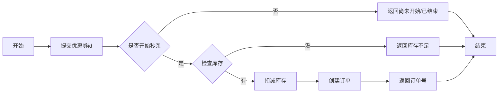

# 优惠券秒杀

# 全局唯一ID

当用户抢购时,就会生成订单并保存到tb_voucher_order这张表中,而订单表如果使用数据库自增ID就存在一些问题

1、id的规律性太明显 

用户能在订单列表看到详细的订单编号，所以今天id的规律性比如今天下一单订单号是10 ，隔天又下一单的订单号是100，用户就能轻易推测是这个商城昨天90单

2、受单表数据量的限制

单张表无法存储大量比如几千万的订单
所以必须要拆成多张表存储，但如何确认订单号不重复

## 全局ID生成器

是一种在分布式系统下用来生成全局唯一ID的工具,一般要满足下列特性:

1. 唯一性
2. 高可用
3. 高性能
4. 递增性
5. 安全性

## Redis实现全局唯一id

```bash
192.168.33.10:6379> INCR key
(integer) 1
192.168.33.10:6379> GET key
"1"
```

目标:

生成这样二进制的"数值" 不是字串
实际上可能是ex: 98575877469664562 然后转二进制

ID的组成部分:
- 符号位: 1bit,永远为0
- 时间戳: 31bit,以秒为单位,可以使用69年
- 序列号: 32bit,秒内的计数器,支持每秒产生2^32个不同ID


```java 
package com.hmdp.utils;

import org.springframework.data.redis.core.StringRedisTemplate;
import org.springframework.stereotype.Component;

import java.time.LocalDateTime;
import java.time.ZoneOffset;
import java.time.format.DateTimeFormatter;

@Component
public class RedisIdWorker {

    private static final long BEGIN_TIMESTAMP = 1704067200L;
    // 序列号的位数
    private static final int COUNT_BITS = 32;

    private StringRedisTemplate stringRedisTemplate;

    public RedisIdWorker(StringRedisTemplate stringRedisTemplate) {
        this.stringRedisTemplate = stringRedisTemplate;
    }

    /**
     *
     * @param keyPrefix 业务前缀
     * @return
     */
    public long nextId(String keyPrefix){

//        符号位: 1bit,永远为0
//        时间戳: 31bit,以秒为单位,可以使用69年
        LocalDateTime now = LocalDateTime.now();
        long nowSecond = now.toEpochSecond(ZoneOffset.UTC);
        long timestamp = nowSecond - BEGIN_TIMESTAMP;

//        序列号: 32bit,秒内的计数器,支持每秒产生2^32个不同ID
        // 获取当前日期 精确到天
        String yyyyMMdd = now.format(DateTimeFormatter.ofPattern("yyyy:MM:dd"));
        // 自增
        long increment = stringRedisTemplate.opsForValue().increment("icr:" + keyPrefix + ":" + yyyyMMdd);

        // 序列号是32 bit 所以时间戳向左移32 来放序列号
        // 意味着 timestamp 的值将被乘以 2的32次方，并且其原来的低位部分(右边)会被填充为0 就可以放序列号， 一天的序列号也不可能超过32 bit 这边rediskey 有 获取当前日期 精确到天
        return timestamp << COUNT_BITS | increment;
    }
}

```

单元测试
```java 
package com.hmdp;

import com.hmdp.utils.RedisIdWorker;
import org.junit.jupiter.api.Test;
import org.springframework.boot.test.context.SpringBootTest;

import javax.annotation.Resource;
import java.util.concurrent.CountDownLatch;
import java.util.concurrent.ExecutorService;
import java.util.concurrent.Executors;

@SpringBootTest
class HmDianPingApplicationTests{
    
    @Resource
    private RedisIdWorker redisIdWorker;
    
    // 创建一个固定大小的线程池，最大线程数为500
    private ExecutorService es = Executors.newFixedThreadPool(500);

@Test
void testIdWorker() throws InterruptedException {
    // 创建一个 CountDownLatch，用于控制线程的同步
    // 这里设置为300，表示需要等待300个线程完成
    CountDownLatch countDownLatch = new CountDownLatch(300);

    // 定义一个任务，任务内容是生成ID并打印
    Runnable task = () -> {
        // 每个线程将生成100个ID
        for(int i = 0; i < 100; i++) {
            // 调用 redisIdWorker 的 nextId 方法生成一个新的 ID
            long id = redisIdWorker.nextId("order");
            // 打印生成的 ID
            System.out.println("id = " + id);
        }
        // 每个线程完成后，调用 countDown() 方法减少计数器的值
        countDownLatch.countDown();
    };

    // 记录开始时间
    long begin = System.currentTimeMillis();

    // 提交300个任务到线程池中执行
    for(int i = 0; i < 300; i++) {
        es.submit(task); // 线程池是异步执行任务
    }

    // 等待所有任务完成，直到计数器减到0
    countDownLatch.await();

    // 记录结束时间
    long end = System.currentTimeMillis();

    // 输出总耗时
    System.out.println("time = " + (end - begin));
  }
}
```

打开小算盘把 98575877469664562 贴上去看二进位
得到
BIN 0001 0101 1110 0011 0110 0011 1101 0000 0000 0000 0000 0111 0101 0011 0010

## 关于 << >> 位移运算符

- 二进制转换为十进制

8 位的二进制数 11010101

最前面的1代表 1 * 2的7次方 以此类推最后面的 1 * 2的0次方  全部加总得到 = 128+64+16+4+1 = 213

0 * 多少都是0

- 十进制转换为二进制

213 % 2 = 106..1 依序除下去取余数最后再从下到上：1,1,0,1,0,1,0,1 就会得到 8 位的二进制数 11010101

- 高位/低位

高位：存储重要信息（如时间戳），通常占据更左侧的位置。

低位：存储次要信息（如递增计数器），通常占据更右侧的位置。

- 100 << 5 

```
long l = 100 << 5; // 等于 100 * 2的五次方 = 3200

原始二进制（100）:      0000 0000 0000 0000 0000 0000 0110 0100
左移 5 位后:           0000 0000 0000 0000 0000 1100 1000 0000

接着将二进制转换为十进制
  1 * 2的10次方
+ 1 * 2的9次方
+ 1 * 2的6次方
--------------
= 1024+512+128
= 3200
```

- 100 << 5 | 2

十进制: 100<<5|2=100×32+2=3202

二进制
```
3200   11001000000
2      00000000010
    -----------------
       11001000010
```

- 100 >> 5

```
原始二进制（100）:      0000 0000 0000 0000 0000 0000 0110 0100
右移 5 位后:           0000 0000 0000 0000 0000 0000 0000 0011


着将二进制转换为十进制
  1 * 2的1次方
+ 1 * 2的0次方
--------------
= 3
```

## 还原 timestamp << 32 | increment 取得incr 跟时间戳

```java
long id = 98575877469664562L;
// 掩码为 0xFFFFFFFF（即二进制的 32 个 1），其值为 4294967295
long increment = id & 4294967295L; // 提取低32位
long timestamp = id >> 32; // 右移32位，获取高位 ，右移后低位的序列号就不存在了
System.out.println("increment = " + increment);
System.out.println("timestamp = " + timestamp);
```

## 总结

全局唯一ID生成策略:
- UUID
- Redis自增
- snowflake算法
- 数据库自增 (用另一张表管理自增ID)

Redis自增ID策略:
- 每天一个key,方便统计订单量
- ID构造是时间戳+计数器

# 添加优惠券

表关系如下:
tb_voucher:优惠券的基本信息,优惠金额、使用规则等
tb_seckill_voucher:优惠券的库存、开始抢购时间,结束抢购时间。特价优惠券才需要填写这些信息

1. 前置作业添加优惠券
POST http://localhost:8081/voucher/seckill
```json 
{
    "shopId": 1,
    "title": "100元代金券",
    "subTitle": "周一至周五均可使用",
    "rules": "全场通用\\n无需预约\\n可无限叠加\\不兑现、不找零\\n仅限堂食",
    "payValue": 8000,
    "actualValue": 10000,
    "type": 1,
    "stock": 100,
    "beginTime": "2024-09-22T10:09:17",
    "endTime": "2024-09-22T23:09:04"
}
```
数据库查看
```sql 
select * from tb_voucher tvo ;
select * from tb_seckill_voucher tsv ;
```


# 案例: 实现秒杀下单

下单时需要判断两点:
1. 秒杀是否开始或结束,如果尚未开始或已经结束则无法下单
2. 库存是否充足,不足则无法下单

## 下单功能

POST /api/voucher-order/seckill/{id} 优惠券id，返回值: 订单id



业务
```java 
package com.hmdp.service.impl;

import com.hmdp.dto.Result;
import com.hmdp.entity.SeckillVoucher;
import com.hmdp.entity.VoucherOrder;
import com.hmdp.mapper.VoucherOrderMapper;
import com.hmdp.service.ISeckillVoucherService;
import com.hmdp.service.IVoucherOrderService;
import com.baomidou.mybatisplus.extension.service.impl.ServiceImpl;
import com.hmdp.utils.RedisIdWorker;
import com.hmdp.utils.UserHolder;
import org.springframework.stereotype.Service;
import org.springframework.transaction.annotation.Transactional;

import javax.annotation.Resource;
import java.time.LocalDateTime;

/**
 * <p>
 *  服务实现类
 * </p>
 *
 * @author 虎哥
 * @since 2021-12-22
 */
@Service
public class IVoucherOrderServiceImpl extends ServiceImpl<VoucherOrderMapper, VoucherOrder> implements IVoucherOrderService {

    @Resource
    private ISeckillVoucherService iSeckillVoucherService;

    @Resource
    private RedisIdWorker redisIdWorker;
    
    @Override
    public Result seckillVoucher(Long voucherId) {

        // 1.查询优惠券
        SeckillVoucher seckillVoucher = iSeckillVoucherService.getById(voucherId);

        // 2.判断秒杀是否开始
        if(seckillVoucher.getBeginTime().isAfter(LocalDateTime.now())){
        // 秒杀是否开始
            return Result.fail("秒杀优惠券尚未开始");
        }

        // 3.判断秒杀是否已经结束
        if(seckillVoucher.getEndTime().isBefore(LocalDateTime.now())){
            return Result.fail("秒杀优惠券已结束");
        }

        // 4.判断库存是否充足
        if(seckillVoucher.getStock() < 1){
            return Result.fail("库存不足");
        }

        // 5.扣减库存
        boolean success = iSeckillVoucherService.update()
                .setSql("stock = stock - 1")
                .eq("voucher_id", voucherId)
                .update();
        if(!success){
            return Result.fail("库存不足");
        }

        // 6.创建订单
        VoucherOrder voucherOrder = new VoucherOrder();
        // 订单id
        long orderId = redisIdWorker.nextId("order");
        voucherOrder.setId(orderId);
        // 用户id
        Long userId = UserHolder.getUser().getId();
        voucherOrder.setUserId(userId);
        // 代金券id
        voucherOrder.setVoucherId(voucherId);
        save(voucherOrder);

        // 7.返回订单id
        return Result.ok(orderId);
    }
}

```

## 秒杀时JMeter 全部返回401

http localhost 8081 

POST /voucher-order/seckill/12

出现401大概率是“短信登录”部分，由于设置了用户登录有效期，有效期一过，redis中无法查询到用户对应的token，然后返回“权限不足—401”的响应码，就在那个RefreshTokenInterceptor拦截器里设置的。

解决方法可以将redis中存储的用户登录token的TTL设置为永久，或者在前端页面重新登录就行

前端页面重新登录，将redis中存储的用户登录token的TTL设置为永久-1

JMeter的部份需要加个请求头 Add/Config Element/Http Header Manager

header authorization	6ed55897-5c45-4599-a548-659c32aba59d

## 超卖

当用JMeter大量访问时就会造成超卖问题

## 乐观锁解决超卖

认为线程安全问题不一定会发生,因此不加锁,只是在更新数据时去判断有没有其它线程对数据做了修改。

1. 如果没有修改则认为是安全的,自己才更新数据。
2. 如果已经被其它线程修改说明发生了安全问题,此时可以重试或异常。

乐观锁的关键是判断之前查询得到的数据是否有被修改过

这边把扣减库存的sql where id = ? and stock = ? 改成 where id = ? and stock > 0

```java
boolean success = iSeckillVoucherService.update()
        .setSql("stock = stock - 1")
        .eq("voucher_id", voucherId)
        .gt("stock" ,0) // where id = ? and stock > 0
        .update();
```

清空订单后重新JMeter测试

```sql 
select * from tb_voucher_order tvo2 ;
select * from tb_seckill_voucher tsv ;

truncate tb_voucher_order; 
update tb_seckill_voucher set stock = 100 where voucher_id = 12;
```


# 案例: 实现一人一单

如何解决一人多单问题

目前
```java
Long userId = UserHolder.getUser().getId();
int count = query().eq("user_id", userId).eq("voucher_id", voucherId).count(); // user_id = ? and voucher_id = ?
if(count > 0){
    return Result.fail("用户已经购买一次");
}
```
通过加锁 synchronized 可以解决在单机情况下的一人一单安全问题 

## synchronized 探讨释放锁的时机
 
1. synchronized 写在方法内部

```java
@Slf4j
@Service
public class VoucherOrderServiceImpl extends ServiceImpl<VoucherOrderMapper, VoucherOrder> implements IVoucherOrderService {

    @Override
    public Result seckillVoucher(Long voucherId) {
        // 1.查询优惠券
        // 2.判断秒杀是否开始
        // 3.判断库存是否充足
        return createVoucherOrder(voucherId);
    }

   @Transactional
    public Result createVoucherOrder(Long voucherId){
        Long userId = UserHolder.getUser().getId();

        /**
            写在方法内部
            先释放锁才会提交事务
            函数结束由spring提交
            锁释放代表其他线程可以进到锁了
            那可能造成事务尚未提交，订单还没写入数据库
            所以应该是事务提交之后再去上锁
        */
        synchronized (userId.toString().intern()) { // 这个 intern() 是为了判断线程id ，只用toString() 的话会每次都new 一个新的，就无法判断
            // 4.查询订单
            // 5.扣减库存
            // 6.创建订单
            // 7.返回订单id
            return Result.ok(orderId);
        }// 释放锁
    }
}
```

2. 

```java
@Slf4j
@Service
public class VoucherOrderServiceImpl extends ServiceImpl<VoucherOrderMapper, VoucherOrder> implements IVoucherOrderService {

    @Override
    public Result seckillVoucher(Long voucherId) {
        // 1.查询优惠券
        // 2.判断秒杀是否开始
        // 3.判断库存是否充足
        Long userId = UserHolder.getUser().getId();
        synchronized (userId.toString().intern()) {
            return createVoucherOrder(voucherId); // 但这还是会遇到一个问题: 事务失效，解决: 用代理对象
        }// 释放锁
    }

   @Transactional
    public Result createVoucherOrder(Long voucherId){
        Long userId = UserHolder.getUser().getId();
        // 4.查询订单
        // 5.扣减库存
        // 6.创建订单
        // 7.返回订单id
        return Result.ok(orderId);
    }
}
```

2.2. 

```java
@Slf4j
@Service
public class VoucherOrderServiceImpl extends ServiceImpl<VoucherOrderMapper, VoucherOrder> implements IVoucherOrderService {

    @Override
    public Result seckillVoucher(Long voucherId) {
        // 1.查询优惠券
        // 2.判断秒杀是否开始
        // 3.判断库存是否充足
        Long userId = UserHolder.getUser().getId();
        synchronized (userId.toString().intern()) {
            IVoucherOrderService proxy = (IVoucherOrderService) AopContext.currentProxy();
            return proxy.createVoucherOrder(voucherId);
            // 原本是 this.createVoucherOrder(voucherId);
        }// 释放锁
    }

   @Transactional
    public Result createVoucherOrder(Long voucherId){
        Long userId = UserHolder.getUser().getId();
        // 4.查询订单
        // 5.扣减库存
        // 6.创建订单
        // 7.返回订单id
        return Result.ok(orderId);
    }
}
```
需要基于接口做调用，所以在接口创建这个函数
```java
public interface IVoucherOrderService extends IService<VoucherOrder> {

    Result seckillVoucher(Long voucherId);

    Result createVoucherOrder(Long voucherId);
}
```

加入依赖 aspectjweaver
```xml 
<dependency>
    <groupId>org.aspectj</groupId>
    <artifactId>aspectjweaver</artifactId>
</dependency>
```

暴露代理对象 @EnableAspectJAutoProxy(exposeProxy = true)
```java 
package com.hmdp;

import org.mybatis.spring.annotation.MapperScan;
import org.springframework.boot.SpringApplication;
import org.springframework.boot.autoconfigure.SpringBootApplication;
import org.springframework.context.annotation.EnableAspectJAutoProxy;

@EnableAspectJAutoProxy(exposeProxy = true)
@MapperScan("com.hmdp.mapper")
@SpringBootApplication
public class HmDianPingApplication {

    public static void main(String[] args) {
        SpringApplication.run(HmDianPingApplication.class, args);
    }

}
```

# 集群下的线程并发安全问题

通过加锁可以解决在单机情况下的一人一单安全问题，但是在集群模式下就不行了。
1. 我们将服务启动两份,端口分别为8081和8082:

2. intellij
Run/Debug Configurations / Modify options / Add VM options/ -Dserver.port=8082

3.  ~\nginx-1.18.0\conf\nginx.conf
```
http {
    server {
        location /api {
            proxy_pass http://backend; # 负载均衡
        }

        upstream backend {
            server 127.0.0.1:8081 max_fails=5 fail_timeout=10s weight=1;
            server 127.0.0.1:8082 max_fails=5 fail_timeout=10s weight=1;
        }  
    }
}
```

重启
```
nginx.exe -s reload
```
4. 测试是否有负载均衡
   
两台服务起来后先清下console 

http://localhost:8080/api/voucher/list/1 

发个两次请求分别看下8081、8082 console

5. 锁监视器

发起两个请求

POST http://localhost:8080/api/voucher-order/seckill/13

header authorization 008067c6-2447-41a1-a108-987a88741c9e

集群下虽然用synchronized 但没锁住还是出现并发安全问题

因为并行运行的情况下不同的JVM有不同的锁监视器

# 分布式锁

## Redis的分布式锁实现思路

实现分布式锁时需要实现的两个基本方法：

* 获取锁：
  * 互斥：确保只能有一个线程获取锁
  * 非阻塞：尝试一次，成功返回true，失败返回false
* 释放锁：
  * 手动释放
  * 超时释放：获取锁时添加一个超时时间

测试
```sql 
-- 获取锁
192.168.33.10:6379> SETNX lock thread1
(integer) 1
192.168.33.10:6379> SETNX lock thread1
(integer) 0

-- 释放锁
192.168.33.10:6379> DEL lock
(integer) 1
192.168.33.10:6379> SETNX lock thread1
(integer) 1

-- 设置存活时间，超时就释放避免死锁
192.168.33.10:6379> EXPIRE lock 10
(integer) 1

192.168.33.10:6379> TTL lock
(integer) 8
192.168.33.10:6379> TTL lock
(integer) 7
192.168.33.10:6379> TTL lock
(integer) 5

-- 原子性: 获取锁并设置存活时间
192.168.33.10:6379> SET lock thread1 EX 10 NX
OK
192.168.33.10:6379> SET lock thread1 EX 10 NX
(nil)
```

## 实现Redis分布式锁

```java 
package com.hmdp.utils;

public interface ILock {
    /**
     * 尝试获取锁
     * @param timeoutSec 超时释放
     * @return true: 成功 ,false: 失败
     */
    boolean tryLock(long timeoutSec);

    /**
     * 释放锁
     */
    void unlock();
}

```

```java 
package com.hmdp.utils;

import org.springframework.data.redis.core.StringRedisTemplate;

import java.util.concurrent.TimeUnit;

public class SimpleRedisLock implements ILock{
    
    private static final String KEY_PREFIX = "lock:"; // 专业前缀
    private String name;// 业务
    private StringRedisTemplate stringRedisTemplate;

    public SimpleRedisLock(String name, StringRedisTemplate stringRedisTemplate) {
        this.name = name;
        this.stringRedisTemplate = stringRedisTemplate;
    }

    @Override
    public boolean tryLock(long timeoutSec) {
        // 获取线程标示
        long threadId = Thread.currentThread().getId(); //提供给锁监视器(setnx) 比对目前是线程几

        // 获取锁 setnx key
        Boolean success = stringRedisTemplate.opsForValue().setIfAbsent(KEY_PREFIX + name, threadId + "", timeoutSec, TimeUnit.SECONDS);
        return Boolean.TRUE.equals(success);
    }

    @Override
    public void unlock() {
        stringRedisTemplate.delete(KEY_PREFIX + name);
    }
}

```

service
```java 
package com.hmdp.service.impl;

import com.hmdp.dto.Result;
import com.hmdp.entity.SeckillVoucher;
import com.hmdp.entity.VoucherOrder;
import com.hmdp.mapper.VoucherOrderMapper;
import com.hmdp.service.ISeckillVoucherService;
import com.hmdp.service.IVoucherOrderService;
import com.baomidou.mybatisplus.extension.service.impl.ServiceImpl;
import com.hmdp.utils.RedisIdWorker;
import com.hmdp.utils.SimpleRedisLock;
import com.hmdp.utils.UserHolder;
import org.springframework.aop.framework.AopContext;
import org.springframework.data.redis.core.StringRedisTemplate;
import org.springframework.stereotype.Service;
import org.springframework.transaction.annotation.Transactional;

import javax.annotation.Resource;
import java.time.LocalDateTime;
import java.util.concurrent.locks.ReentrantLock;

/**
 * <p>
 *  服务实现类
 * </p>
 *
 * @author 虎哥
 * @since 2021-12-22
 */
@Service
public class IVoucherOrderServiceImpl extends ServiceImpl<VoucherOrderMapper, VoucherOrder> implements IVoucherOrderService {

    @Resource
    private ISeckillVoucherService seckillVoucherService;

    @Resource
    private StringRedisTemplate stringRedisTemplate;
    @Resource
    private RedisIdWorker redisIdWorker;

    private final ReentrantLock lock = new ReentrantLock();
    @Override
    public Result seckillVoucher(Long voucherId) {
        // 1.查询优惠券
        // 2.判断秒杀是否开始/已经结束
        // 3.判断库存是否充足
        
        Long userId = UserHolder.getUser().getId();

        SimpleRedisLock simpleRedisLock = new SimpleRedisLock("order:" + userId, stringRedisTemplate);
        boolean isLock = simpleRedisLock.tryLock(1200);

        if(!isLock){
            return Result.fail("不允许重复下单");
        }

        try {
            // 获取代理对象(事务)
            IVoucherOrderService proxy = (IVoucherOrderService) AopContext.currentProxy();
            return proxy.createVoucherOrder(voucherId);
        } finally {
            // 释放
            simpleRedisLock.unlock();
        }
    }

    @Transactional
    public Result createVoucherOrder(Long voucherId){
       Long userId = UserHolder.getUser().getId();
        // 4.查询订单
        // 5.扣减库存
        // 6.创建订单
        // 7.返回订单id
        return Result.ok(orderId);
    }
}
```

## Redis分布式锁误删问题

问题: 线程1获取锁后业务阻塞，TTL超时就先释放了，这时线程1业务完成后还是会释放锁，但却释放了其他线程的锁，影响到其他线程

## 解决Redis分布式锁误删问题

两个JVM 可能产生线程id重复

改进Redis的分布式锁
需求:修改之前的分布式锁实现,满足:
1. 在获取锁时存入线程标示(可以用UUID表示)
2. 在释放锁时先获取锁中的线程标示,判断是否与当前线程标示一致
- 如果一致则释放锁
- 如果不一致则不释放锁

```java
package com.hmdp.utils;

import cn.hutool.core.lang.UUID;
import org.springframework.core.io.ClassPathResource;
import org.springframework.data.redis.core.StringRedisTemplate;
import org.springframework.data.redis.core.script.DefaultRedisScript;

import java.util.Collections;
import java.util.concurrent.TimeUnit;

public class SimpleRedisLock implements ILock {
    private String name;// 业务
    private StringRedisTemplate stringRedisTemplate;

    public SimpleRedisLock(String name, StringRedisTemplate stringRedisTemplate) {
        this.name = name;
        this.stringRedisTemplate = stringRedisTemplate;
    }

    private static final String KEY_PREFIX = "lock:"; // 专业前缀
    private static final String ID_PREFIX = UUID.randomUUID().toString(true) + "-";

    private static final DefaultRedisScript<Long> UNLOCK_SCRIPT;

    static {
        UNLOCK_SCRIPT = new DefaultRedisScript<>();
        UNLOCK_SCRIPT.setLocation(new ClassPathResource("unlock.lua"));
        UNLOCK_SCRIPT.setResultType(Long.class);
    }
    @Override
    public boolean tryLock(long timeoutSec) {
        // 获取线程标示
        String threadId = ID_PREFIX + Thread.currentThread().getId();//提供给锁监视器(setnx) 比对目前是线程几
        // 获取锁
        Boolean success = stringRedisTemplate.opsForValue().setIfAbsent(KEY_PREFIX + name, threadId, timeoutSec, TimeUnit.SECONDS);
        return Boolean.TRUE.equals(success);
    }

    @Override
    public void unlock() {
        // 获取线程标示
        String threadId = ID_PREFIX + Thread.currentThread().getId();
        // 获取所中的标示
        String id = stringRedisTemplate.opsForValue().get(KEY_PREFIX + name);
        // 判断线程是否一致
        if (threadId.equals(id)) {
            //释放锁
            stringRedisTemplate.delete(KEY_PREFIX + name);
        }
    }
}
```
测试

断点可以下在获取锁跟释放锁的位置

模拟: 其中一个超时，误删锁

8081 砍redis

8082 获取锁 8081再去比对线程释放锁发现不一致

8082 结束比对线程释放锁

# 分布式锁的原子性问题 

问题: 线程1获取锁后前面都正常，这时线程1释放锁时阻塞了(JVM垃圾回收)，这时TTL超时就先释放了，接着没阻塞后线程1释放锁却释放了其他线程的锁，影响到其他线程

## Lua脚本解决多条命令原子性问题

参考网站:
https://www.runoob.com/lua/lua-tutorial.html

测试
```sql
192.168.33.10:6379> EVAL "return redis.call('set','name','feed')" 0
OK
192.168.33.10:6379> get name
"feed"

-- 如果脚本中的key、value不想写死,可以作为参数传递。key类型参数会放入KEYS数组,其它参数会放入ARGV数组,在脚本中可以从KEYS和ARGV数组获取这些参数
192.168.33.10:6379> EVAL "return redis.call('set',KEYS[1],ARGV[1])" 1 name feed2
OK
192.168.33.10:6379> get name
"feed2"
```

## 释放锁的业务流程

1. 获取锁中的线程标示
2. 判断是否与指定的标示(当前线程标示)一致
3. 如果一致则释放锁(删除)
4. 如果不一致则什么都不做

## Lua 脚本练习

```lua
-- 锁的key
local key = "local:order:5"

-- 当前线程标示 
local threadId = "uuid-33"

-- 获取所中的线程标示 get key
local id = redis.call('get', key)

-- 比较线程标示 与锁中标示 是否一致
if(id == threadId) then
    -- 释放锁 del key
    return redis.call('del', key)
end
return 0
```
 
记得锁的key、当前线程标示threadId 不能写死

```lua
-- 锁的key
local key = KEYS[1]

-- 当前线程标示 
local threadId = ARGV[1]

-- 获取所中的线程标示 get key
local id = redis.call('get', key)

-- 比较线程标示 与锁中标示 是否一致
if(id == threadId) then
    -- 释放锁 del key
    return redis.call('del', key)
end
return 0
```

简化
```lua
-- 锁的key KEYS[1] ,当前线程标示  ARGV[1]，获取所中的线程标示 get key
local id = redis.call('get', KEYS[1])

-- 比较线程标示 与锁中标示 是否一致
if(id == ARGV[1]) then
    -- 释放锁 del key
    return redis.call('del', KEYS[1])
end
return 0
```

简化
```lua
-- 比较线程标示 与锁中标示 是否一致
if(redis.call('get', KEYS[1]) == ARGV[1]) then
    -- 释放锁 del key
    return redis.call('del', KEYS[1])
end
return 0
```

因为释放时是del 成功会返回1
```
192.168.33.10:6379> del name
(integer) 1
```

# Java调用lua脚本改造分布式锁

```java 
package com.hmdp.utils;

import cn.hutool.core.lang.UUID;
import org.springframework.core.io.ClassPathResource;
import org.springframework.data.redis.core.StringRedisTemplate;
import org.springframework.data.redis.core.script.DefaultRedisScript;

import java.util.Collections;
import java.util.concurrent.TimeUnit;

public class SimpleRedisLock implements ILock {
    private String name;// 业务
    private StringRedisTemplate stringRedisTemplate;

    public SimpleRedisLock(String name, StringRedisTemplate stringRedisTemplate) {
        this.name = name;
        this.stringRedisTemplate = stringRedisTemplate;
    }

    private static final String KEY_PREFIX = "lock:"; // 专业前缀
    private static final String ID_PREFIX = UUID.randomUUID().toString(true) + "-";


private static final DefaultRedisScript<Long> UNLOCK_SCRIPT;

    static {
        UNLOCK_SCRIPT = new DefaultRedisScript<>();
        UNLOCK_SCRIPT.setLocation(new ClassPathResource("unlock.lua"));
        UNLOCK_SCRIPT.setResultType(Long.class);
    }

     @Override
    public void unlock() {
        stringRedisTemplate.execute(
                UNLOCK_SCRIPT,
                Collections.singletonList(KEY_PREFIX + name),
                ID_PREFIX + Thread.currentThread().getId());
    }
}
```

## 总结

基于Redis的分布式锁实现思路:
- 利用set nx ex获取锁,并设置过期时间,保存线程标示

释放锁时先判断线程标示是否与自己一致,一致则删除锁
特性:
- 利用set nx满足互斥性
- 利用set ex保证故障时锁依然能释放,避免死锁,提高安全性
- 利用Redis集群保证高可用和高并发特性

# 分布式锁 Redisson功能介绍

基于setnx实现的分布式锁存在下面的问题:

1. 不可重入

同一个线程无法多次获取同一把锁

2. 不可重试

获取锁只尝试一次就返回false,没有重试机制

3. 超时释放

锁超时释放虽然可以避免死锁,但如果是业务执行耗时较长,也会导致锁释放,存在安全隐患

4. 主从一致性

如果Redis提供了主从集群,主从同步存在延迟,当主宕机时,如果从并同步主中的锁数据,则会出现锁实现

## Redisson

Redisson是一个在Redis的基础上实现的Java驻内存数据网格(In-Memory Data Grid)。它不仅提供了一系列的分布式的Java常用对象,还提供了许多分布式服务,其中就包含了各种分布式锁的实现

## Redisson

Redisson是一个在Redis的基础上实现的Java驻内存数据网格(In-Memory Data Grid)。它不仅提供了一系列的分布式的Java常用对象,还提供了许多分布式服务,其中就包含了各种分布式锁的实现。

8.0. 分布式锁(Lock) 和同步器(Synchronizer)
   
8.1. 可重入锁(Reentrant Lock)

8.2.公平锁(Fair Lock)

8.3.联锁(MultiLock)

8.4. 红锁(RedLock)

8.5. 读写锁(ReadWriteLock)

8.6. 信号量(Semaphore)

8.7. 可过期性信号量(PermitExpirableSemaphore)

8.8.闭锁(CountDownLatch)

官网地址: https://redisson.org

GitHub地址:https://github.com/redisson/redisson

## 分布式锁 Redisson快速入门

依赖

```xml 
<dependency>
    <groupId>org.redisson</groupId>
    <artifactId>redisson</artifactId>
    <version>3.13.6</version>
</dependency>
```

配置Redisson客户端
```java 
package com.hmdp.config;

import org.redisson.Redisson;
import org.redisson.api.RedissonClient;
import org.redisson.config.Config;
import org.springframework.context.annotation.Bean;
import org.springframework.context.annotation.Configuration;
@Configuration
public class RedisConfig {
    
    @Bean
    public RedissonClient redissonClient() {
        // 配置类
        Config config = new Config();
        // 添加redis地址,这里添加了单点的地址,也可以使用config.useclusterServers()添加集群地址
        config.useSingleServer().setAddress("redis://192.168.33.10:6379").setPassword("qwe123");
        // 创建客户端
        return Redisson.create(config);
    }
}
```

使用Redisson的分布式锁

```java 
package com.hmdp.service.impl;

import com.hmdp.dto.Result;
import com.hmdp.entity.SeckillVoucher;
import com.hmdp.entity.VoucherOrder;
import com.hmdp.mapper.VoucherOrderMapper;
import com.hmdp.service.ISeckillVoucherService;
import com.hmdp.service.IVoucherOrderService;
import com.baomidou.mybatisplus.extension.service.impl.ServiceImpl;
import com.hmdp.utils.RedisIdWorker;
import com.hmdp.utils.SimpleRedisLock;
import com.hmdp.utils.UserHolder;
import org.springframework.aop.framework.AopContext;
import org.springframework.data.redis.core.StringRedisTemplate;
import org.springframework.stereotype.Service;
import org.springframework.transaction.annotation.Transactional;

import javax.annotation.Resource;
import java.time.LocalDateTime;
import java.util.concurrent.locks.ReentrantLock;

/**
 * <p>
 *  服务实现类
 * </p>
 *
 * @author 虎哥
 * @since 2021-12-22
 */
@Service
public class IVoucherOrderServiceImpl extends ServiceImpl<VoucherOrderMapper, VoucherOrder> implements IVoucherOrderService {

    @Resource
    private ISeckillVoucherService seckillVoucherService;

    @Resource
    private StringRedisTemplate stringRedisTemplate;
    @Resource
    private RedisIdWorker redisIdWorker;

    @Resource
    private RedissonClient redissonClient;

    private final ReentrantLock lock = new ReentrantLock();
    @Override
    public Result seckillVoucher(Long voucherId) {
        // 1.查询优惠券
        // 2.判断秒杀是否开始/已经结束
        // 3.判断库存是否充足
    
        Long userId = UserHolder.getUser().getId();

        RLock lock = redissonClient.getLock("lock:order:" + userId);

        boolean isLock = lock.tryLock();
        if(!isLock){ // 避免嵌套
            return Result.fail("不允许重复下单");
        }

        try {
            // 获取代理对象(事务)
            IVoucherOrderService proxy = (IVoucherOrderService) AopContext.currentProxy();
            return proxy.createVoucherOrder(voucherId);
        } finally {
            // 释放
            lock.unlock();
        }
     }
}
```

## Redisson的可重入锁原理

测试

```java 
package com.hmdp;

import lombok.extern.slf4j.Slf4j;
import org.junit.jupiter.api.BeforeEach;
import org.junit.jupiter.api.Test;
import org.redisson.api.RLock;
import org.redisson.api.RedissonClient;
import org.springframework.boot.test.context.SpringBootTest;

import javax.annotation.Resource;
import java.util.concurrent.TimeUnit;

@Slf4j
@SpringBootTest
class RedissonTest {

    @Resource
    private RedissonClient redissonClient;

    private RLock lock;

    @BeforeEach
    void setUp() {
        lock = redissonClient.getLock("RedissonTest:order");
    }

    @Test
    void method1() throws InterruptedException {
        // 尝试获取锁
        boolean isLock = lock.tryLock(1L,3000, TimeUnit.SECONDS);
        if (!isLock) {
            log.error("获取锁失败 .... 1");
            return;
        }
        try {
            log.info("获取锁成功 .... 1");
            method2();
            log.info("开始执行业务 ... 1");
        } finally {
            log.warn("准备释放锁 .... 1");
            lock.unlock();
        }
    }
    void method2() throws InterruptedException {
        // 尝试获取锁
        boolean isLock = lock.tryLock(1L,3000, TimeUnit.SECONDS);
        if (!isLock) {
            log.error("获取锁失败 .... 2");
            return;
        }
        try {
            log.info("获取锁成功 .... 2");
            log.info("开始执行业务 ... 2");
        } finally {
            log.warn("准备释放锁 .... 2");
            lock.unlock();
        }
    }
}

```

## Redisson的锁重试和WatchDog机制


Redisson分布式锁原理:

- 可重入:利用hash结构记录线程id和重入次数
- 可重试:利用信号量和PubSub功能实现等待、唤醒,获取锁失败的重试机制
- 超时续约:利用watchDog,每隔一段时间(releaseTime/3),重置超时时间

## Redisson的multiLock原理

另外创建两个redis server
```bash
# 复制第一个来改
[vagrant@localhost ~]$ sudo cp /path/to/local/redis.conf /path/to/local/redis2.conf
[vagrant@localhost ~]$ sudo cp /path/to/local/redis.conf /path/to/local/redis3.conf

[vagrant@localhost local]$ sudo vi redis2.conf
[vagrant@localhost local]$ sudo vi redis3.conf
# redis2.conf 示例
bind 0.0.0.0
port 6380
daemonize no
appendonly yes
maxmemory 512mb
requirepass qwe123
dir .
logfile "redis2.log"

[vagrant@localhost local]$ docker run -d \
   --name redis2 \
   -p 6380:6380 \
   -v /path/to/local/redis2.conf:/usr/local/etc/redis/redis.conf \
   redis:latest \
   redis-server /usr/local/etc/redis/redis.conf
26f5aea21d659a2215bcd9d117b3a3ee736f63ea3523b3e8f925a24918ac3e0e

[vagrant@localhost local]$ docker run -d \
   --name redis3 \
   -p 6381:6381 \
   -v /path/to/local/redis3.conf:/usr/local/etc/redis/redis.conf \
   redis:latest \
   redis-server /usr/local/etc/redis/redis.conf
06b387775b7739d2a6705a08d1fcb5b0f2b273319c937b614a0617297e374812

[vagrant@localhost local]$ docker ps
CONTAINER ID   IMAGE          COMMAND                  CREATED          STATUS          PORTS                                                 NAMES
26f5aea21d65   redis:latest   "docker-entrypoint.s…"   4 seconds ago    Up 2 seconds    6379/tcp, 0.0.0.0:6380->6380/tcp, :::6380->6380/tcp   redis2
06b387775b77   redis:latest   "docker-entrypoint.s…"   25 seconds ago   Up 23 seconds   6379/tcp, 0.0.0.0:6381->6381/tcp, :::6381->6381/tcp   redis3
26f85fd018ed   redis:latest   "docker-entrypoint.s…"   2 weeks ago      Up 8 days       0.0.0.0:6379->6379/tcp, :::6379->6379/tcp             my-redis

[vagrant@localhost local]$ docker exec -it redis2 bash
root@26f5aea21d65:/data#

[vagrant@localhost local]$ docker exec -it redis3 bash
root@26f5aea21d65:/data#
```

设置
```java 
package com.hmdp.config;

import org.redisson.Redisson;
import org.redisson.api.RedissonClient;
import org.redisson.config.Config;
import org.springframework.context.annotation.Bean;
import org.springframework.context.annotation.Configuration;

@Configuration
public class RedissonConfig {
    
    @Bean
    public RedissonClient redissonClient(){
        Config config = new Config();
        config.useSingleServer().setAddress("redis://192.168.33.10:6379").setPassword("qwe123");
        return Redisson.create(config);
    }
    @Bean
    public RedissonClient redissonClient2(){
        Config config = new Config();
        config.useSingleServer().setAddress("redis://192.168.33.10:6380").setPassword("qwe123");
        return Redisson.create(config);
    }
    @Bean
    public RedissonClient redissonClient3(){
        Config config = new Config();
        config.useSingleServer().setAddress("redis://192.168.33.10:6381").setPassword("qwe123");
        return Redisson.create(config);
    }
}
```

单元测试
```java 
package com.hmdp;

import lombok.extern.slf4j.Slf4j;
import org.junit.jupiter.api.BeforeEach;
import org.junit.jupiter.api.Test;
import org.redisson.api.RLock;
import org.redisson.api.RedissonClient;
import org.springframework.boot.test.context.SpringBootTest;

import javax.annotation.Resource;
import java.util.concurrent.TimeUnit;

@Slf4j
@SpringBootTest
class RedissonTest {

    @Resource
    private RedissonClient redissonClient;
    @Resource
    private RedissonClient redissonClient2;
    @Resource
    private RedissonClient redissonClient3;

    private RLock lock;

    @BeforeEach
    void setUp() {
        RLock lock1 = redissonClient.getLock("RedissonTest:order");
        RLock lock2 = redissonClient2.getLock("RedissonTest:order");
        RLock lock3 = redissonClient3.getLock("RedissonTest:order");
        // 创建连锁 multiLock
        lock = redissonClient.getMultiLock(lock1 ,lock2 ,lock3);
    }

    @Test
    void method1() throws InterruptedException {
        // 尝试获取锁
        boolean isLock = lock.tryLock(1L, TimeUnit.SECONDS);
        if (!isLock) {
            log.error("获取锁失败 .... 1");
            return;
        }
        try {
            log.info("获取锁成功 .... 1");
            method2();
            log.info("开始执行业务 ... 1");
        } finally {
            log.warn("准备释放锁 .... 1");
            lock.unlock();
        }
    }
    void method2() throws InterruptedException {
        // 尝试获取锁
        boolean isLock = lock.tryLock(1L, TimeUnit.SECONDS);
        if (!isLock) {
            log.error("获取锁失败 .... 2");
            return;
        }
        try {
            log.info("获取锁成功 .... 2");
            log.info("开始执行业务 ... 2");
        } finally {
            log.warn("准备释放锁 .... 2");
            lock.unlock();
        }
    }
}
```

## 总结

1. 不可重入Redis分布式锁:
- 原理: 利用setnx的互斥性;利用ex避免死锁;释放锁时判断线程标示
- 缺陷: 不可重入、无法重试、锁超时失效

2. 可重入的Redis分布式锁:
- 原理: 利用hash结构,记录线程标示和重入次数;利用watchDog延续锁时间;利用信号量控制锁重试等待
- 缺陷: redis宕机引起锁失效问题

3、Redisson的multiLock:
- 原理: 多个独立的Redis节点,必须在所有节点都获取重入锁,才算获取锁成功
- 缺陷: 运维成本高、实现复杂、

# 秒杀优化

前置作业

1. 生成测试用户: /api/user/login-createTestuser，拦截器记得放行
2. 配置JMeter Add/Config Element/CSV Data Set Config
   - CSV Data Set Config/Filename: /api/user/login-createTestuser 看你token档案存放在哪
   - CSV Data Set Config/Variable Names: token 用来JMeter的请求头 ${token}

优化方向:

目前分成 查询优惠券、判断库存、查询订单、效验是否一人一单 / 减库存、创建订单

前4项就像点餐，后两项就像厨师收到点餐开始煮菜

你点餐的时后不会在那边等到餐点做完，通常结账后会先拿到一个点餐后的订单号

所以我们就可以把属于点餐的部份可以先搬出来redis查询，先返回订单id给用户一个相当于点餐后的单号，后续的写入数据库慢慢来就可

为确保原子性 查询的部份也是会用Lua脚本

执行Lua脚本后会判断 在创建订单前需要先检查是否有该优惠券、是否开始秒杀、库存是否充足、效验一人一单 最后返回0 ，才能异步下单

# 案例: 基于Redis完成秒杀资格判断

改进秒杀业务,提高并发性能
需求:
1. 新增秒杀优惠券的同时,将优惠券信息保存到Redis中
2. 基于Lua脚本,判断秒杀库存、一人一单,决定用户是否抢购成功
3. 如果抢购成功,将优惠券id和用户id封装后存入阻塞队列
4. 开启线程任务,不断从阻塞队列中获取信息,实现异步下单功能

## 1. 新增秒杀优惠券的同时,将优惠券信息保存到Redis中

```java 
package com.hmdp.service.impl;

import com.baomidou.mybatisplus.extension.service.impl.ServiceImpl;
import com.hmdp.dto.Result;
import com.hmdp.entity.Voucher;
import com.hmdp.mapper.VoucherMapper;
import com.hmdp.entity.SeckillVoucher;
import com.hmdp.service.ISeckillVoucherService;
import com.hmdp.service.IVoucherService;
import org.springframework.data.redis.core.StringRedisTemplate;
import org.springframework.stereotype.Service;
import org.springframework.transaction.annotation.Transactional;

import javax.annotation.Resource;
import java.time.LocalDateTime;
import java.time.ZoneOffset;
import java.util.HashMap;
import java.util.List;
import java.util.Map;

import static com.hmdp.utils.RedisConstants.SECKILL_STOCK_KEY;

/**
 * <p>
 *  服务实现类
 * </p>
 *
 * @author 虎哥
 * @since 2021-12-22
 */
@Service
public class VoucherServiceImpl extends ServiceImpl<VoucherMapper, Voucher> implements IVoucherService {

    @Resource
    private ISeckillVoucherService seckillVoucherService;

    @Resource
    private StringRedisTemplate stringRedisTemplate;


    @Override
    @Transactional
    public void addSeckillVoucher(Voucher voucher) {
        // 保存优惠券
        save(voucher);
        // 保存秒杀信息
        SeckillVoucher seckillVoucher = new SeckillVoucher();
        seckillVoucher.setVoucherId(voucher.getId());
        seckillVoucher.setStock(voucher.getStock());
        seckillVoucher.setBeginTime(voucher.getBeginTime());
        seckillVoucher.setEndTime(voucher.getEndTime());
        seckillVoucherService.save(seckillVoucher);
        
        // 保存秒杀库存到Redis中: 库存
//        stringRedisTemplate.opsForValue().set(SECKILL_STOCK_KEY + voucher.getId(), voucher.getStock().toString());
        
        // 保存秒杀库存到Redis中: 库存、开始、结束时间
        Map<String ,Object> map = new HashMap<>();
        map.put("seckill:stock:" + voucher.getId() ,voucher.getStock().toString());
        map.put("seckill:beginTime:" + voucher.getId() ,String.valueOf(voucher.getBeginTime().toEpochSecond(ZoneOffset.UTC)));
        map.put("seckill:endTime:" + voucher.getId() ,String.valueOf(voucher.getEndTime().toEpochSecond(ZoneOffset.UTC)));
        stringRedisTemplate.opsForHash().putAll("seckill:" + voucher.getId() ,map);
    }
}
```

## 2. 基于Lua脚本,判断秒杀库存、一人一单,决定用户是否抢购成功

```lua 
-- 1.参数列表
-- 1.1. 优惠券id
local voucherId = ARGV[1]
-- 1.2. 用户id
local userId = ARGV[2]

-- 2. 数据key
local seckillKey = "seckill:" .. voucherId
-- 2.1. 库存key
local stockKey = "seckill:stock:" .. voucherId
-- 2.2. 订单key
local orderKey = "seckill:order:" .. voucherId

local beginTime = "seckill:beginTime:" .. voucherId
local endTime = "seckill:endTime:" .. voucherId

local now = tonumber(redis.call('TIME')[1]) -- 获取当前时间戳
local begin = tonumber(redis.call('hget' ,seckillKey ,beginTime))
local ending = tonumber(redis.call('hget' ,seckillKey ,endTime))

if begin == nil then
    return 5 -- 无此活动
end

if ending == nil then
    return 5 -- 无此活动
end

if now < begin then
    return 3 -- 活动尚未开始
end

if now > ending then
    return 4 -- 活动已结束
end

-- 3. 脚本业务
-- 3.1. 判断库存是否充足 get stockKey
if(tonumber(redis.call('hget' ,seckillKey ,stockKey)) <= 0) then
    return 1
end
-- 3.2. 判断用户是否下过单 sismember orderKey userId
if(redis.call('sismember' ,orderKey ,userId) == 1 )then
    -- 存在，说明重复下单
   return 2
end
-- 3.3. 扣库存
redis.call('hincrby' ,seckillKey ,stockKey ,-1)
-- 3.4. 下单(保存用户)
redis.call('sadd' ,orderKey ,userId)
return 0
```


测试

```java 
package com.hmdp.service.impl;

import com.hmdp.dto.Result;
import com.hmdp.entity.SeckillVoucher;
import com.hmdp.entity.VoucherOrder;
import com.hmdp.mapper.VoucherOrderMapper;
import com.hmdp.service.ISeckillVoucherService;
import com.hmdp.service.IVoucherOrderService;
import com.baomidou.mybatisplus.extension.service.impl.ServiceImpl;
import com.hmdp.utils.RedisIdWorker;
import com.hmdp.utils.SimpleRedisLock;
import com.hmdp.utils.UserHolder;
import org.redisson.api.RLock;
import org.redisson.api.RedissonClient;
import org.springframework.aop.framework.AopContext;
import org.springframework.core.io.ClassPathResource;
import org.springframework.data.redis.core.StringRedisTemplate;
import org.springframework.data.redis.core.script.DefaultRedisScript;
import org.springframework.stereotype.Service;
import org.springframework.transaction.annotation.Transactional;

import javax.annotation.Resource;
import java.time.LocalDateTime;
import java.util.Collections;
import java.util.Objects;
import java.util.concurrent.locks.ReentrantLock;

/**
 * <p>
 *  服务实现类
 * </p>
 *
 * @author 虎哥
 * @since 2021-12-22
 */
@Service
public class IVoucherOrderServiceImpl extends ServiceImpl<VoucherOrderMapper, VoucherOrder> implements IVoucherOrderService {

    @Resource
    private ISeckillVoucherService seckillVoucherService;

    @Resource
    private StringRedisTemplate stringRedisTemplate;
    @Resource
    private RedisIdWorker redisIdWorker;

    @Resource
    private RedissonClient redissonClient;

    private static final DefaultRedisScript<Long> SECKILL_SCRIPT;

    static {
        SECKILL_SCRIPT = new DefaultRedisScript<>();
        SECKILL_SCRIPT.setLocation(new ClassPathResource("seckill.lua"));
        SECKILL_SCRIPT.setResultType(Long.class);
    }

    @Override
    public Result seckillVoucher_Lua(Long voucherId) {
        Long userId = UserHolder.getUser().getId();
        Long execute = stringRedisTemplate.execute(
                SECKILL_SCRIPT,
                Collections.emptyList(),
                voucherId.toString(), userId.toString());
        int i = Objects.requireNonNull(execute).intValue();
        switch (i){
            case 1: return Result.fail("库存不足");
            case 2: return Result.fail("不允许重复下单");
            case 3: return Result.fail("秒杀优惠券尚未开始");
            case 4: return Result.fail("秒杀优惠券已结束");
            case 5: return Result.fail("无此秒杀优惠券活动");
        }
        // i == 0 返回订单id
        long orderId = redisIdWorker.nextId("order");
        // TODO: 保存队列
        return Result.ok(orderId);
    }
}

```

先新增两笔优惠券 

然后下单试试

POST http://localhost:8081/voucher/seckill

```json
{
    "shopId": 1,
    "title": "100元代金券3",
    "subTitle": "周一至周五均可使用",
    "rules": "全场通用\\n无需预约\\n可无限叠加\\不兑现、不找零\\n仅限堂食",
    "payValue": 8000,
    "actualValue": 10000,
    "type": 1,
    "stock": 100,
    "beginTime": "2024-10-01T10:09:17",
    "endTime": "2024-10-26T23:09:04"
}
```
```
{
    "shopId": 1,
    "title": "100元代金券4",
    "subTitle": "周一至周五均可使用",
    "rules": "全场通用\\n无需预约\\n可无限叠加\\不兑现、不找零\\n仅限堂食",
    "payValue": 8000,
    "actualValue": 10000,
    "type": 1,
    "stock": 100,
    "beginTime": "2024-10-01T10:09:17",
    "endTime": "2024-10-26T23:09:04"
}
```

POST http://localhost:8080/api/voucher-order/seckill/24

POST http://localhost:8080/api/voucher-order/seckill/23

header: authorization e3a61ab5-f833-4e36-aa8f-50ae26d0b95e

## 3. 如果抢购成功,将优惠券id和用户id封装后存入阻塞队列4. 开启线程任务,不断从阻塞队列中获取信息,实现异步下单功能

```java 
package com.hmdp.service.impl;

import com.hmdp.dto.Result;
import com.hmdp.entity.SeckillVoucher;
import com.hmdp.entity.VoucherOrder;
import com.hmdp.mapper.VoucherOrderMapper;
import com.hmdp.service.ISeckillVoucherService;
import com.hmdp.service.IVoucherOrderService;
import com.baomidou.mybatisplus.extension.service.impl.ServiceImpl;
import com.hmdp.utils.RedisIdWorker;
import com.hmdp.utils.SimpleRedisLock;
import com.hmdp.utils.UserHolder;
import lombok.extern.slf4j.Slf4j;
import org.redisson.api.RLock;
import org.redisson.api.RedissonClient;
import org.springframework.aop.framework.AopContext;
import org.springframework.core.io.ClassPathResource;
import org.springframework.data.redis.core.StringRedisTemplate;
import org.springframework.data.redis.core.script.DefaultRedisScript;
import org.springframework.stereotype.Service;
import org.springframework.transaction.annotation.Transactional;

import javax.annotation.PostConstruct;
import javax.annotation.Resource;
import java.time.LocalDateTime;
import java.util.Collections;
import java.util.Objects;
import java.util.concurrent.ArrayBlockingQueue;
import java.util.concurrent.BlockingQueue;
import java.util.concurrent.ExecutorService;
import java.util.concurrent.Executors;
import java.util.concurrent.locks.ReentrantLock;

/**
 * <p>
 *  服务实现类
 * </p>
 *
 * @author 虎哥
 * @since 2021-12-22
 */
@Slf4j
@Service
public class IVoucherOrderServiceImpl extends ServiceImpl<VoucherOrderMapper, VoucherOrder> implements IVoucherOrderService {

    @Resource
    private ISeckillVoucherService seckillVoucherService;

    @Resource
    private StringRedisTemplate stringRedisTemplate;
    @Resource
    private RedisIdWorker redisIdWorker;

    @Resource
    private RedissonClient redissonClient;

    private static final DefaultRedisScript<Long> SECKILL_SCRIPT;

    static {
        SECKILL_SCRIPT = new DefaultRedisScript<>();
        SECKILL_SCRIPT.setLocation(new ClassPathResource("seckill.lua"));
        SECKILL_SCRIPT.setResultType(Long.class);
    }

    private BlockingQueue<VoucherOrder> orderTasks = new ArrayBlockingQueue<>(1024 * 1024);

    private static final ExecutorService SECKILL_ORDER_EXECUTOR = Executors.newSingleThreadExecutor();

    // 当前类一初始化就来执行
    @PostConstruct
    private void init(){
        // 提交任务
        SECKILL_ORDER_EXECUTOR.submit(new VoucherOrderHandler());
    }

    // 内部类: 线程任务
    private class VoucherOrderHandler implements Runnable{

        @Override
        public void run() {
            while (true){
                try {
                    // 获取队列中订单信息
                    VoucherOrder voucherOrder = orderTasks.take(); // take 获取队列中的头部
                    // 创建订单
                    handleVoucherOrder(voucherOrder);
                } catch (Exception e) {
                    log.error("处理订单异常" ,e);
                }
            }
        }
    }

    private void handleVoucherOrder(VoucherOrder voucherOrder) {
        // 获取用户
//        Long userId = UserHolder.getUser().getId(); // 因为现在是子线程 是拿不到ThreadLocal
        Long userId = voucherOrder.getUserId();
        // 创建锁对象
        RLock lock = redissonClient.getLock("lock:order:" + userId);
        // 尝试获取锁
        boolean isLock = lock.tryLock();
        // 判断是否获取锁成功
        if(!isLock){
            log.error("不允许重复下单");
            return;
        }

        try {
            proxy.createVoucherOrder_Lua(voucherOrder);
        } finally {
            // 释放
            lock.unlock();
        }
    }

    // 设置成员变量就不用一直拿
    private IVoucherOrderService proxy;

    @Override
    public Result seckillVoucher_Lua(Long voucherId) {

        Long userId = UserHolder.getUser().getId();

        Long execute = stringRedisTemplate.execute(
                SECKILL_SCRIPT,
                Collections.emptyList(),
                voucherId.toString(), userId.toString());
        int i = Objects.requireNonNull(execute).intValue();

        switch (i){
            case 1: return Result.fail("库存不足");
            case 2: return Result.fail("不允许重复下单");
            case 3: return Result.fail("秒杀优惠券尚未开始");
            case 4: return Result.fail("秒杀优惠券已结束");
            case 5: return Result.fail("无此秒杀优惠券活动");
        }

        // i == 0 返回订单id
        long orderId = redisIdWorker.nextId("order");

        // 有购买资格,把下单信息保存到阻塞队列 (创建订单)
        VoucherOrder voucherOrder = new VoucherOrder();
        // 订单id
        voucherOrder.setId(orderId);
        // 用户id
        voucherOrder.setUserId(userId);
        // 代金券id
        voucherOrder.setVoucherId(voucherId);

        // 保存到阻塞队列
        orderTasks.add(voucherOrder);

        // 获取代理对象(事务)
        proxy = (IVoucherOrderService) AopContext.currentProxy();
        // 保存队列
        return Result.ok(orderId);
    }

    @Override
    @Transactional
    public void createVoucherOrder_Lua(VoucherOrder voucherOrder) {
        //  Long userId = UserHolder.getUser().getId(); // 因为现在是子线程 是拿不到ThreadLocal

        Long userId = voucherOrder.getUserId();
        Long voucherId = voucherOrder.getVoucherId();

        // 4.查询订单
        // 5.扣减库存
        // 6.创建订单
         save(voucherOrder);
        // x 返回订单id  因为是异步，所以不用返回信息给用户了
    }
}
```

## 总结

秒杀业务的优化思路是什么?
1. 先利用Redis完成库存余量、一人一单判断,完成抢单业务
2. 再将下单业务放入阻塞队列,利用独立线程异步下单

基于阻塞队列的异步秒杀存在哪些问题?
1. 内存限制问题
2. 数据安全问题

JVM 阻塞队列

高并发情况下可能超出内存限制上限

没有持久化，服务重启或宕机，数据会丢失

从阻塞队列拿到一个任务尚未处理时发生异常，该任务就不会被执行，也是会丢失

# Redis消息队列


## 认识消息队列

消息队列(Message Queue),字面意思就是存放消息的队列。最简单的消息队列模型包括3个角色:
1. 消息队列:存储和管理消息,也被称为消息代理(Message Broker)
2. 生产者:发送消息到消息队列
3. 消费者:从消息队列获取消息并处理消息

Redis提供了三种不同的方式来实现消息队列
- list结构: 基于List结构模拟消息队列
- PubSub: 基本的点对点消息模型
- Stream: 比较完善的消息队列模型

## 基于List实现消息队列

消息队列(Message Queue),字面意思就是存放消息的队列。而Redis的list数据结构是一个双向链表,很容易模拟
出队列效果。

队列是入口和出口不在一边,因此我们可以利用:LPUSH 结合 RPOP、或者 RPUSH 结合 LPOP来实现。

不过要注意的是,当队列中没有消息时RPOP或LPOP操作会返回null,并不像JVM的阻塞队列那样会阻塞并等待消息。

因此这里应该使用BRPOP或者BLPOP来实现阻塞效果。

这边是用 XShell 连到 VM

```bash
# 1
192.168.33.10:6379> LPUSH l1 e1 e2 

# 2
192.168.33.10:6379> BRPOP l1
```

### 总结
基于List的消息队列有哪些优缺点?
优点:
- 利用Redis存储,不受限于JVM内存上限
- 基于Redis的持久化机制,数据安全性有保证
- 可以满足消息有序性

缺点:
- 无法避免消息丢失
- 只支持单消费者

## 基于PubSub实现消息队列

PubSub(发布订阅)是Redis2.0版本引入的消息传递模型。顾名思义,消费者可以订阅一个或多个channel,生产者
向对应channel发送消息后,所有订阅者都能收到相关消息。
- SUBSCRIBE channel [channel]:订阅一个或多个频道
- PUBLISH channel msg:向一个频道发送消息
- PSUBSCRIBE pattern[pattern]: 订阅与pattern格式匹配的所有频道

```bash
# 1
192.168.33.10:6379> SUBSCRIBE order.q1

# 2
192.168.33.10:6379> PSUBSCRIBE order.*

# 3
192.168.33.10:6379> PUBLISH order.q3 hello
```

### 总结

基于PubSub的消息队列有哪些优缺点?
优点:
- 采用发布订阅模型,支持多生产、多消费

缺点:
- 不支持数据持久化
- 无法避免消息丢失
- 消息堆积有上限,超出时数据丢失


## 基于Stream的消息队列

Stream是Redis 5.0 引入的一种新数据类型,可以实现一个功能非常完善的消息队列。

```bash
# 发送消息
XADD key [NOMKSTREAM] [MAXLEN|MINID [=|~] threshold [LIMIT count]] *|id field value [field value ...]
XADD [key] [] [] [唯一id，用* reids会自己创建] [key value ...] 
XADD s1 * k1 v1

# 读取消息
XREAD [COUNT count] [BLOCK milliseconds] STREAMS key [key ...] id [id ...]
XREAD [读取消息 数量] [是否阻塞 时长] [key] [从第几个消息开始]
XREAD COUNT 1 STREAMS s1 0
XREAD COUNT 1 BLOCK 0 STREAMS s1 $
```

```bash
# 生产者
192.168.33.10:6379> XADD s1 * k1 v1
"1727939736892-0"
192.168.33.10:6379> XLEN s1
(integer) 1

# 消费者1
192.168.33.10:6379> XREAD COUNT 1 STREAMS s1 0
1) 1) "s1"
   2) 1) 1) "1727939736892-0"
         2) 1) "k1"
            2) "v1"
192.168.33.10:6379> XREAD COUNT 1 STREAMS s1 $
(nil)
192.168.33.10:6379> XREAD COUNT 1 BLOCK 0 STREAMS s1 $

# 消费者2
192.168.33.10:6379> XREAD COUNT 1 STREAMS s1 0
1) 1) "s1"
   2) 1) 1) "1727939736892-0"
         2) 1) "k1"
            2) "v1"


192.168.33.10:6379> XADD s1 * k5 v5
"1727940706188-0"
192.168.33.10:6379> XADD s1 * k6 v6
"1727940735421-0"

# 消费者1
192.168.33.10:6379> XREAD COUNT 1 BLOCK 0 STREAMS s1 $

# 生产者
192.168.33.10:6379> XADD s1 * k7 v7
"1727940752029-0"

# 消费者1
192.168.33.10:6379> XREAD COUNT 1 BLOCK 0 STREAMS s1 $
1) 1) "s1"
   2) 1) 1) "1727940752029-0"
         2) 1) "k7"
            2) "v7"
(4.92s)
```


会有漏读消息的状况

### 总结

STREAM类型消息队列的XREAD命令特点:
- 消息可回溯
- 一个消息可以被多个消费者读取
- 可以阻塞读取
- 有消息漏读的风险


## Stream的消费者组模式

消费者组(Consumer Group):将多个消费者划分到一个组中,监听同一个队列。具备下列特点:

1. 消息分流

队列中的消息会分流给组内的不同消费者,而不是重复消费,从而加快消息处理的速度

2. 消息标示

消费者组会维护一个标示,记录最后一个被处理的消息,哪怕消费者宕机重启,还会从标示之后读取消息。确保每一个消息都会被消费

3. 消息确认

消费者获取消息后,消息处于pending状态,并存入一个pending-list。当处理完成后需要通过XACK来确认消息,标记消息为已处理,才会从pending-list移除。

```bash
# 创建组 
XGROUP CREATE key group id|$ [MKSTREAM] [ENTRIESREAD entries-read]
XGROUP CREATE s1 g1 0

# 读消息
XREADGROUP GROUP group consumer [COUNT count] [BLOCK milliseconds] [NOACK] STREAMS key [key ...] id [id ...]
XREADGROUP GROUP [哪个组] [哪个消费者] [读取消息 数量] [是否阻塞 时长] [是否确认消息] [key] [>代表从下一个未确认的消息开始]
XREADGROUP GROUP g1 c1 COUNT 1 BLOCK 2000 STREAMS s1 >
# 把> 改成0 可以读取pending-list 未确认的消息
XREADGROUP GROUP g1 c2 COUNT 1 BLOCK 2000 STREAMS s1 0


# 确认消息
XACK key group id [id ...]
XACK s1 g1 1727940075557-0 1727939736892-0

# 未确认消息列表
XPENDING key group [[IDLE min-idle-time] start end count [consumer]]
```

```bash
192.168.33.10:6379> XGROUP CREATE s1 g1 0
OK

# 消费者1
192.168.33.10:6379> XREADGROUP GROUP g1 c1 COUNT 1 BLOCK 2000 STREAMS s1 >
1) 1) "s1"
   2) 1) 1) "1727939736892-0"
         2) 1) "k1"
            2) "v1"
192.168.33.10:6379> XREADGROUP GROUP g1 c1 COUNT 1 BLOCK 2000 STREAMS s1 >
1) 1) "s1"
   2) 1) 1) "1727940075557-0"
         2) 1) "k2"
            2) "v2"

# 确认上面这两个消息
192.168.33.10:6379> XACK s1 g1 1727940075557-0 1727939736892-0
(integer) 2

# 消费者2
192.168.33.10:6379> XREADGROUP GROUP g1 c2 COUNT 1 BLOCK 2000 STREAMS s1 >
1) 1) "s1"
   2) 1) 1) "1727940699886-0"
         2) 1) "k3"
            2) "v3"
192.168.33.10:6379> XREADGROUP GROUP g1 c2 COUNT 1 BLOCK 2000 STREAMS s1 >
1) 1) "s1"
   2) 1) 1) "1727940703333-0"
         2) 1) "k4"
            2) "v4"
# 把> 改成0 可以读取pending-list 未确认的消息
192.168.33.10:6379> XREADGROUP GROUP g1 c2 COUNT 1 BLOCK 2000 STREAMS s1 0
1) 1) "s1"
   2) 1) 1) "1727940699886-0"
         2) 1) "k3"
            2) "v3"


# 可以看到目前 消费者2(c2) 读了 k3、k4 但未确认
# 所以c2 XREADGROUP > 改成 0 读取未确认消息时可以读到k3
# 而消费者1(c1) XREADGROUP > 改成 0 读取未确认消息时却只能读到k5开始
192.168.33.10:6379> XPENDING s1 g1 - + 10
1) 1) "1727940699886-0"
   2) "c2"
   3) (integer) 158731
   4) (integer) 3
2) 1) "1727940703333-0"
   2) "c2"
   3) (integer) 274447
   4) (integer) 1
3) 1) "1727940706188-0"
   2) "c1"
   3) (integer) 146562
   4) (integer) 2

```

### 总结

STREAM类型消息队列的XREADGROUP命令特点:
- 消息可回溯
- 可以多消费者争抢消息,加快消费速度
- 可以阻塞读取
- 没有消息漏读的风险
- 有消息确认机制,保证消息至少被消费一次

# 案例: 基于Redis的Stream结构作为消息队列,实现异步秒杀下单

需求:
1. 创建一个Stream类型的消息队列,名为stream.orders
2. 修改之前的秒杀下单Lua脚本,在认定有抢购资格后,直接向stream.orders中添加消息,内容包含 voucherld, userld, orderld
3. 项目启动时,开启一个线程任务,尝试获取stream.orders中的消息,完成下单

```bash
# 没先创建组的话，初始化时后会找不到组
192.168.33.10:6379> XGROUP CREATE stream.orders g1 0 MKSTREAM
OK
```


Lua脚本更新

1. 订单id
2. 发送消息， XADD stream.orders


```lua
-- 1.参数列表
-- 1.1. 优惠券id
local voucherId = ARGV[1]
-- 1.2. 用户id
local userId = ARGV[2]
-- 1.3. 订单Id
local orderId = ARGV[3]

-- 2. 数据key
local seckillKey = "seckill:" .. voucherId
-- 2.1. 库存key
local stockKey = "seckill:stock:" .. voucherId
-- 2.2. 订单key
local orderKey = "seckill:order:" .. voucherId

local beginTime = "seckill:beginTime:" .. voucherId
local endTime = "seckill:endTime:" .. voucherId

local now = tonumber(redis.call('TIME')[1]) -- 获取当前时间戳
local begin = tonumber(redis.call('hget' ,seckillKey ,beginTime))
local ending = tonumber(redis.call('hget' ,seckillKey ,endTime))

if begin == nil then
    return 5 -- 无此活动
end

if ending == nil then
    return 5 -- 无此活动
end

if now < begin then
    return 3 -- 活动尚未开始
end

if now > ending then
    return 4 -- 活动已结束
end

-- 3. 脚本业务
-- 3.1. 判断库存是否充足 get stockKey
if(tonumber(redis.call('hget' ,seckillKey ,stockKey)) <= 0) then
    return 1
end
-- 3.2. 判断用户是否下过单 sismember orderKey userId
if(redis.call('sismember' ,orderKey ,userId) == 1 )then
    -- 存在，说明重复下单
   return 2
end
-- 3.3. 扣库存
redis.call('hincrby' ,seckillKey ,stockKey ,-1)
-- 3.4. 下单(保存用户)
redis.call('sadd' ,orderKey ,userId)

-- 3.5. 发送消息， XADD stream.orders * k1 v1 k2 v2
redis.call('xadd' ,'stream.orders' ,'*' ,'userId' ,userId ,'voucherId' ,voucherId ,'id' ,orderId)

return 0
```

业务

```java 
package com.hmdp.service.impl;

import cn.hutool.core.bean.BeanUtil;
import com.hmdp.dto.Result;
import com.hmdp.entity.SeckillVoucher;
import com.hmdp.entity.VoucherOrder;
import com.hmdp.mapper.VoucherOrderMapper;
import com.hmdp.service.ISeckillVoucherService;
import com.hmdp.service.IVoucherOrderService;
import com.baomidou.mybatisplus.extension.service.impl.ServiceImpl;
import com.hmdp.utils.RedisIdWorker;
import com.hmdp.utils.SimpleRedisLock;
import com.hmdp.utils.UserHolder;
import lombok.extern.slf4j.Slf4j;
import org.redisson.api.RLock;
import org.redisson.api.RedissonClient;
import org.springframework.aop.framework.AopContext;
import org.springframework.core.io.ClassPathResource;
import org.springframework.data.redis.connection.stream.*;
import org.springframework.data.redis.core.StringRedisTemplate;
import org.springframework.data.redis.core.script.DefaultRedisScript;
import org.springframework.stereotype.Service;
import org.springframework.transaction.annotation.Transactional;

import javax.annotation.PostConstruct;
import javax.annotation.Resource;
import java.time.Duration;
import java.time.LocalDateTime;
import java.util.Collections;
import java.util.List;
import java.util.Map;
import java.util.Objects;
import java.util.concurrent.ArrayBlockingQueue;
import java.util.concurrent.BlockingQueue;
import java.util.concurrent.ExecutorService;
import java.util.concurrent.Executors;
import java.util.concurrent.locks.ReentrantLock;

/**
 * <p>
 *  服务实现类
 * </p>
 *
 * @author 虎哥
 * @since 2021-12-22
 */
@Slf4j
@Service
public class IVoucherOrderServiceImpl extends ServiceImpl<VoucherOrderMapper, VoucherOrder> implements IVoucherOrderService {

    @Resource
    private ISeckillVoucherService seckillVoucherService;

    @Resource
    private StringRedisTemplate stringRedisTemplate;
    @Resource
    private RedisIdWorker redisIdWorker;

    @Resource
    private RedissonClient redissonClient;

    private static final DefaultRedisScript<Long> SECKILL_SCRIPT;

    static {
        SECKILL_SCRIPT = new DefaultRedisScript<>();
        SECKILL_SCRIPT.setLocation(new ClassPathResource("seckill.lua"));
        SECKILL_SCRIPT.setResultType(Long.class);
    }


    private static final ExecutorService SECKILL_ORDER_EXECUTOR = Executors.newSingleThreadExecutor();

    // 当前类一初始化就来执行
    @PostConstruct
    private void init(){
        // 提交任务
        SECKILL_ORDER_EXECUTOR.submit(new VoucherOrderHandler());
    }

    // 内部类: 线程任务
    private class VoucherOrderHandler implements Runnable{
        String queueName = "stream.orders";
        @Override
        public void run() {
            // XGROUP CREATE
            while (true){
                try {
                    // 1.获取消息队列中的订单信息 XREADGROUP GROUP g1 c1 COUNT 1 BLOCK 2000 stream.orders >
                    List<MapRecord<String, Object, Object>> list = stringRedisTemplate.opsForStream().read(
                            Consumer.from("g1", "c1"),
                            StreamReadOptions.empty().count(1).block(Duration.ofSeconds(2)),
                            StreamOffset.create(queueName, ReadOffset.lastConsumed())
                    );

                    // 2.判断消息获取是否成功
                    if(list == null || list.isEmpty()){

                    // 2.1.如果获取失败,说明没有消息,继续下一次循环
                        continue;
                    }

                    // 解析消息中的订单信息
                    MapRecord<String, Object, Object> entries = list.get(0);
                    Map<Object, Object> values = entries.getValue();
                    VoucherOrder voucherOrder = BeanUtil.fillBeanWithMap(values, new VoucherOrder(), true);

                    // 3.如果获取成功,可以下单
                    handleVoucherOrder(voucherOrder);

                    // 4.ACK确认 SACK stream.orders g1 id
                    stringRedisTemplate.opsForStream().acknowledge(queueName ,"g1",entries.getId());

                } catch (Exception e) {
                    log.error("处理订单异常" ,e);
                    handlePendingList();
                }
            }
        }

        // 未确认消息
        private void handlePendingList() {
            while (true){
                try {
                    // 1.获取pending-list中的订单信息 XREADGROUP GROUP g1 c1 COUNT 1 stream.orders 0
                    List<MapRecord<String, Object, Object>> list = stringRedisTemplate.opsForStream().read(
                            Consumer.from("g1", "c1"),
                            StreamReadOptions.empty().count(1),
                            StreamOffset.create(queueName, ReadOffset.from("0"))
                    );
                    // 2.判断消息获取是否成功
                    if(list == null || list.isEmpty()){
                        // 2.1.如果获取失败,说明pending-list中没有消息,,结束循环
                        break;
                    }
                    // 解析消息中的订单信息
                    MapRecord<String, Object, Object> entries = list.get(0);
                    Map<Object, Object> values = entries.getValue();
                    VoucherOrder voucherOrder = BeanUtil.fillBeanWithMap(values, new VoucherOrder(), true);

                    // 3.如果获取成功,可以下单
                    handleVoucherOrder(voucherOrder);
                    // 4.ACK确认 SACK stream.orders g1 id
                    stringRedisTemplate.opsForStream().acknowledge(queueName ,"g1",entries.getId());
                } catch (Exception e) {
                    log.error("处理pending-list订单异常" ,e);
                }
            }
        }
    }

    private void handleVoucherOrder(VoucherOrder voucherOrder) {
        // 获取用户
//        Long userId = UserHolder.getUser().getId(); // 因为现在是子线程 是拿不到ThreadLocal
        Long userId = voucherOrder.getUserId();

        // 创建锁对象
        RLock lock = redissonClient.getLock("lock:order:" + userId);

        // 尝试获取锁
        boolean isLock = lock.tryLock();

        // 判断是否获取锁成功
        if(!isLock){
            log.error("不允许重复下单");
            return;
        }

        try {
            proxy.createVoucherOrder_Lua(voucherOrder);
        } finally {
            // 释放
            lock.unlock();
        }
    }

    private IVoucherOrderService proxy;

    @Override
    public Result seckillVoucher_Lua2(Long voucherId) {
        Long userId = UserHolder.getUser().getId();

        long orderId = redisIdWorker.nextId("order");

        Long execute = stringRedisTemplate.execute(
                SECKILL_SCRIPT,
                Collections.emptyList(),
                voucherId.toString(), userId.toString() ,String.valueOf(orderId));

        int i = Objects.requireNonNull(execute).intValue();
        switch (i){
            case 1: return Result.fail("库存不足");
            case 2: return Result.fail("不允许重复下单");
            case 3: return Result.fail("秒杀优惠券尚未开始");
            case 4: return Result.fail("秒杀优惠券已结束");
            case 5: return Result.fail("无此秒杀优惠券活动");
        }

        // 获取代理对象(事务)
        proxy = (IVoucherOrderService) AopContext.currentProxy();
        // 保存队列
        // i == 0 返回订单id
        return Result.ok(orderId);
    }

    @Override
    @Transactional
    public void createVoucherOrder_Lua(VoucherOrder voucherOrder) {
        //  Long userId = UserHolder.getUser().getId(); // 因为现在是子线程 是拿不到ThreadLocal

        Long userId = voucherOrder.getUserId();
        Long voucherId = voucherOrder.getVoucherId();

        // 4.查询订单
        // 5.扣减库存
        // 6.创建订单
         save(voucherOrder);
        // x 返回订单id  因为是异步，所以不用返回信息给用户了
    }
}
```
